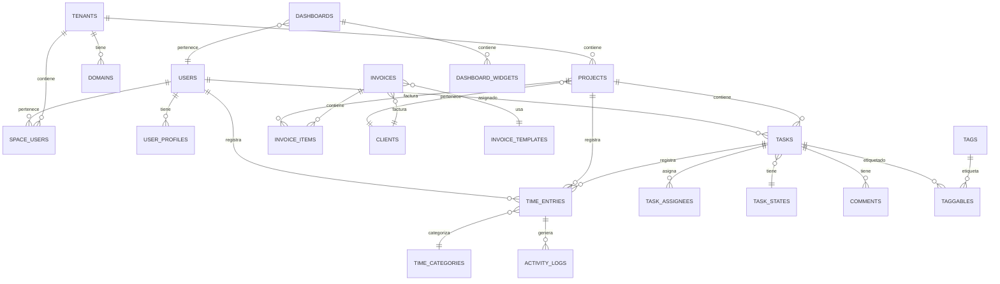

# EnkiFlow: Roadmap de Lanzamiento Acelerado

## Información del Documento
- **Versión:** 1.0
- **Fecha:** Mayo 2025
- **Enfoque:** Lanzamiento rápido al mercado
- **Responsable:** Equipo EnkiFlow

---

## Resumen Ejecutivo

Este roadmap presenta una estrategia acelerada para llevar EnkiFlow al mercado, priorizando el desarrollo de un Producto Mínimo Viable (MVP) con las funcionalidades esenciales que aporten valor inmediato a los usuarios, seguido de iteraciones rápidas basadas en feedback real. A diferencia del roadmap técnico completo, este plan se enfoca en:

1. Priorizar características de alto impacto para el usuario
2. Implementar ciclos de desarrollo ultracortos (1-2 semanas)
3. Aprovechar Claude y otras herramientas de IA para acelerar el desarrollo
4. Adoptar un enfoque de lanzamiento progresivo con usuarios reales
5. Integrar feedback y mejoras continuamente

La meta es tener un producto en manos de los primeros usuarios en **8 semanas** y una versión comercial completa en **20 semanas** (versus las 56 semanas del plan original).

---

## Modelo de Datos del Sistema

Basado en el análisis del proyecto existente y los requerimientos del roadmap acelerado, se ha diseñado el siguiente modelo de datos optimizado para Laravel 12:

### Diagrama de Entidad-Relación

### Estructura de Tablas Principales

#### Sistema Multi-tenant
- `users`: Usuarios del sistema con autenticación
- `user_profiles`: Información ampliada del perfil de usuario
- `tenants`: Espacios de trabajo (implementación multi-tenant)
- `domains`: Dominios asociados a cada tenant
- `space_users`: Relación entre usuarios y espacios con roles

#### Gestión de Proyectos
- `clients`: Clientes para los que se realizan proyectos
- `projects`: Proyectos con presupuesto y estado
- `task_states`: Estados personalizables para tareas
- `tasks`: Tareas con relaciones jerárquicas
- `task_assignees`: Asignación múltiple de usuarios a tareas

#### Seguimiento de Tiempo
- `time_categories`: Categorías para clasificar entradas de tiempo
- `time_entries`: Registro de tiempo con relaciones a proyectos/tareas
- `activity_logs`: Seguimiento detallado de actividad para detección automática

#### Reportes y Dashboards
- `dashboards`: Dashboards personalizables por usuario
- `dashboard_widgets`: Widgets configurables para dashboards
- `saved_reports`: Informes guardados con programación

#### Facturación
- `invoice_templates`: Plantillas personalizables de facturas
- `invoices`: Facturas con estado y totales
- `invoice_items`: Líneas detalladas de factura

#### Extensibilidad
- `tags` y `taggables`: Sistema de etiquetado polimórfico
- `comments`: Comentarios polimórficos para cualquier entidad
- `integrations`: Integraciones con servicios externos
- `webhook_endpoints`: Puntos de conexión para webhooks
- `activity_log`: Registro auditable de cambios en el sistema

Este modelo de datos está diseñado para optimizar el rendimiento, permitir escalar la aplicación, y facilitar la implementación de las funcionalidades prioritarias del MVP.

---

## Análisis de Mercado y Funcionalidades Prioritarias

Basado en investigación de mercado de las tendencias 2025 para aplicaciones de gestión de tareas y seguimiento de tiempo, estas son las funcionalidades clave que los usuarios esperan por categoría y rango de precio:

### 1. Gestión de Tareas (Tipo Todoist Enhanced)

**Funcionalidades Base (Plan Gratuito / Basic):**
- Sistema de tareas jerárquico con proyectos/listas y subtareas
- Vista de lista principal con opciones de ordenación básicas
- Fecha límite y prioridades (4 niveles)
- Etiquetas simples para categorización
- Filtros básicos (por fecha, proyecto, prioridad)
- Recordatorios básicos (una vez por tarea)
- Capacidad de comentarios en tareas
- Interfaz limpia y minimalista enfocada en la simplicidad

**Funcionalidades Pro (Plan Pagado Básico, ~$5-8/mes):**
- Vistas múltiples: Lista, Kanban, Calendario
- Tareas recurrentes con patrones complejos
- Campos personalizados para tareas
- Filtros y búsqueda avanzada
- Recordatorios múltiples y basados en ubicación
- Colaboración limitada (hasta 5 usuarios)
- Integración con calendario (Google, Outlook)
- Plantillas de proyectos reutilizables
- Priorización inteligente basada en fecha/importancia
- Seguimiento básico de hábitos

**Funcionalidades Business (Plan Empresarial, ~$12-15/mes):**
- Dependencias entre tareas
- Vista Gantt para proyectos complejos
- Colaboración ilimitada con roles y permisos
- Estado personalizable del flujo de trabajo
- Integración con 30+ herramientas externas
- Estadísticas de productividad y reportes
- Automatizaciones avanzadas con condiciones
- Tableros compartidos con clientes/externos
- Importación/exportación masiva
- API completa para personalización

### 2. Seguimiento de Tiempo

**Funcionalidades Base (Plan Gratuito / Basic):**
- Temporizador manual con botones iniciar/pausar/detener
- Asociación de tiempo a proyectos/tareas
- Historial básico de tiempo registrado
- Edición manual de entradas de tiempo
- Reporte simple (diario/semanal)
- Categorización básica del tiempo

**Funcionalidades Pro (Plan Pagado Básico):**
- Seguimiento automatizado con recordatorios
- Detección de inactividad
- Etiquetas y categorías personalizables
- Temporizador con descripción continua
- Informes visuales personalizables
- Exportación a formatos estándar (CSV, Excel)
- Temporizador desde múltiples dispositivos
- Tiempo estimado vs. real

**Funcionalidades Business:**
- Seguimiento automático de aplicaciones
- Integración con facturación
- Aprobaciones de tiempo registrado
- Costos y presupuestos por proyecto
- Múltiples tasas de facturación
- Reportes avanzados por cliente/proyecto/usuario
- Control de horas facturables vs. no facturables
- Reglas de redondeo personalizadas

### 3. Colaboración y Equipos

**Funcionalidades Base:**
- Espacios compartidos básicos
- Comentarios en tareas
- Notificaciones básicas de cambios
- Permisos simples (ver/editar)

**Funcionalidades Pro:**
- Asignación múltiple de tareas
- Notificaciones personalizables
- Estado de disponibilidad
- Roles ampliados (administrador, miembro, observador)
- Actividad de equipo en tiempo real
- Menciones (@usuario)

**Funcionalidades Business:**
- Controles de acceso basados en roles
- Espacios de trabajo aislados (multitenancy)
- Integración con directorio empresarial
- Auditoría de actividad
- Permisos granulares por proyecto
- Reglas de automatización por equipo
- Plantillas de equipos

### 4. Integración y Extensibilidad

**Funcionalidades Base:**
- Integración con calendario personal
- Email a tarea
- Extensión de navegador simple

**Funcionalidades Pro:**
- Integración bidireccional con Google/Outlook
- Webhooks básicos
- API limitada
- Integración con 10-15 servicios populares
- Sincronización entre dispositivos

**Funcionalidades Business:**
- API completa
- Webhooks avanzados
- Integraciones premium (Salesforce, Jira)
- SSO (inicio de sesión único)
- Conectores personalizados
- Automatización entre servicios

### 5. Análisis y Reportes

**Funcionalidades Base:**
- Vista de productividad simple
- Filtros básicos por fecha

**Funcionalidades Pro:**
- Informes personalizables
- Tablero de productividad personal
- Tendencias por semana/mes
- Exportación a formatos múltiples

**Funcionalidades Business:**
- Informes programados por email
- Métricas de productividad del equipo
- Exportación personalizada y white-label
- Tableros interactivos en tiempo real
- Análisis predictivo

### 6. UX/UI y Accesibilidad

**Expectativas generales:**
- Diseño responsivo para todos los dispositivos
- Modo oscuro/claro
- Accesos rápidos de teclado
- Tiempo de carga rápido (<2s)
- Interfaz minimalista pero potente
- Sincronización offline
- Adaptable a diferentes flujos de trabajo
- Personalización de la interfaz

### Tendencias 2025 a Incorporar

1. **Asistentes IA para productividad**
   - Categorización automática de tareas
   - Recomendaciones de priorización
   - Estimación inteligente de tiempo
   - Detección de patrones de productividad

2. **Integración trabajo-vida**
   - Gestión unificada de tareas personales y laborales
   - Prevención de burnout con métricas de equilibrio
   - Programación adaptativa según energía disponible

3. **Enfoque en bienestar**
   - Seguimiento de descansos (técnica pomodoro)
   - Recordatorios de pausas basados en patrones
   - Datos de productividad contextualizados

4. **Hiperpersonalización**
   - Flujos de trabajo adaptables por usuario
   - Interfaces configurables
   - Automatizaciones personalizadas

### Estrategia de Precios Competitiva (2025)

- **Free**: Funcionalidades básicas para usuarios individuales (límite de proyectos/tareas)
- **Pro**: $7-9/mes - Ideal para freelancers y profesionales (todas las funcionalidades personales)
- **Business**: $12-15/usuario/mes - Para equipos pequeños y medianos
- **Enterprise**: $18-25/usuario/mes - Para organizaciones grandes con necesidades complejas

Este análisis de mercado nos permite priorizar las funcionalidades para el MVP de EnkiFlow y garantizar que estemos alineados con las expectativas de los usuarios en 2025, ofreciendo un valor excepcional en cada nivel de precio.

---

## Tareas Técnicas Detalladas para el Desarrollo MVP

A continuación se detallan las tareas técnicas organizadas por componentes funcionales, con un enfoque en las mejores prácticas de Laravel 12 y desarrollo moderno.

### 1. Configuración de Infraestructura Base

#### 1.1 Configuración del Proyecto Laravel 12
- **Tarea**: Inicialización del proyecto con Laravel 12
- **Detalles Técnicos**:
  - Utilizar `composer create-project laravel/laravel`
  - Configurar Docker para desarrollo local utilizando Laravel Sail
  - Implementar scaffolding básico con Laravel Jetstream
  - Configurar Inertia.js con Vue 3 para frontend SPA

#### 1.2 Implementación de Multi-tenancy
- **Tarea**: Configurar sistema multi-tenant
- **Detalles Técnicos**:
  - Integrar `stancl/tenancy` para separación de datos por tenant
  - Configurar migraciones para tablas centrales y específicas de tenant
  - Implementar middleware de identificación de tenant por dominio/subdominio
  - Desarrollar sistema de invitación de usuarios a espacios
  - Configurar el ciclo de vida de tenant (creación, eliminación, migración)

#### 1.3 Sistema de Autenticación y Autorización
- **Tarea**: Implementar autenticación y autorización robusta
- **Detalles Técnicos**:
  - Utilizar Laravel Breeze/Jetstream para autenticación base
  - Integrar `spatie/laravel-permission` para gestión de roles y permisos
  - Implementar autenticación social (Google, Microsoft) con Socialite
  - Configurar Guards específicos para tenants
  - Desarrollar Policies y Gates para control de acceso granular
  - Implementar verificación por email y recuperación de contraseña

### 2. Desarrollo del Sistema de Gestión de Tareas

#### 2.1 Modelos y Migraciones
- **Tarea**: Implementar la estructura de datos para tareas y proyectos
- **Detalles Técnicos**:
  - Crear migraciones para `projects`, `tasks`, `task_states`
  - Implementar relaciones polimórficas para `tags` y `comments`
  - Configurar soft deletes para preservación de datos históricos
  - Implementar indicadores para tareas recurrentes
  - Establecer estruturas jerárquicas (máquina de estados)

#### 2.2 API RESTful para Tareas
- **Tarea**: Desarrollar endpoints completos para gestión de tareas
- **Detalles Técnicos**:
  - Implementar API Resource Controllers
  - Utilizar API Resources para transformación de datos
  - Implementar validación con Form Requests
  - Configurar paginación y filtrado avanzado con `spatie/laravel-query-builder`
  - Implementar versionado de API
  - Documentar API con OpenAPI/Swagger

#### 2.3 Interfaz de Usuario Kanban
- **Tarea**: Desarrollar vista Kanban interactiva
- **Detalles Técnicos**:
  - Implementar componentes Vue 3 con Composition API
  - Utilizar libreria de arrastrar y soltar (Vue.Draggable)
  - Crear componentes para columnas, tarjetas de tareas y acciones
  - Implementar actualización en tiempo real con Laravel Echo y WebSockets
  - Desarrollar filtros y búsqueda contextual
  - Optimizar renderizado para gran cantidad de tareas

#### 2.4 Máquina de Estados para Tareas
- **Tarea**: Implementar sistema de estados configurable
- **Detalles Técnicos**:
  - Utilizar `spatie/laravel-model-states` para estados de tareas
  - Implementar transiciones de estado con validaciones
  - Crear webhook triggers para cambios de estado
  - Configurar acciones automáticas por cambio de estado
  - Desarrollar UI para configuración de flujos de trabajo

### 3. Desarrollo del Sistema de Seguimiento de Tiempo

#### 3.1 Modelos y Migraciones
- **Tarea**: Implementar estructura de datos para tiempo
- **Detalles Técnicos**:
  - Crear migraciones para `time_entries`, `time_categories`
  - Implementar campos para tiempo billable/no-billable
  - Configurar relaciones con tareas y proyectos
  - Implementar mecanismos de auditoría para entradas de tiempo

#### 3.2 Temporizador en Tiempo Real
- **Tarea**: Desarrollar sistema de temporizador interactivo
- **Detalles Técnicos**:
  - Implementar componente Vue 3 para temporizador
  - Utilizar Local Storage para persistencia en caso de desconexiones
  - Implementar sincronización periódica con backend
  - Desarrollar detección de inactividad
  - Implementar alertas y notificaciones para recordatorios

#### 3.3 Informes y Visualización
- **Tarea**: Crear sistema de visualización de tiempo registrado
- **Detalles Técnicos**:
  - Desarrollar consultas optimizadas para agregación de datos
  - Implementar cache estratégico con Redis
  - Crear componentes de gráficos con Chart.js
  - Implementar filtros dinámicos con Livewire
  - Desarrollar sistema de exportación a CSV/Excel con Laravel Excel

### 4. Sistema de Colaboración y Equipos

#### 4.1 Gestión de Equipos
- **Tarea**: Implementar gestión completa de usuarios y equipos
- **Detalles Técnicos**:
  - Desarrollar sistema de invitación por email
  - Implementar roles por espacio (`admin`, `member`, `guest`)
  - Crear interfaz de gestión de permisos
  - Configurar auditoría de cambios con Laravel Auditing

#### 4.2 Notificaciones en Tiempo Real
- **Tarea**: Implementar sistema de notificaciones
- **Detalles Técnicos**:
  - Utilizar Laravel Notifications
  - Configurar canales múltiples (database, email, push)
  - Implementar WebSockets con Laravel Echo y Pusher/Ably
  - Desarrollar preferencias de notificación por usuario
  - Crear componente de notificaciones en tiempo real

### 5. Integraciones y API

#### 5.1 Integración con Calendario
- **Tarea**: Implementar sincronización bidireccional con calendarios
- **Detalles Técnicos**:
  - Integrar Google Calendar API
  - Implementar Microsoft Outlook API
  - Desarrollar sincronización de eventos y tareas
  - Crear trabajos programados para actualización periódica

#### 5.2 API Pública
- **Tarea**: Desarrollar API pública documentada
- **Detalles Técnicos**:
  - Implementar autenticación OAuth 2.0 con Passport
  - Crear sistema de tokens de API
  - Implementar rate limiting y seguridad
  - Documentar API con OpenAPI/Swagger UI

### 6. Performance y Escalabilidad

#### 6.1 Optimización de Consultas
- **Tarea**: Optimizar consultas a base de datos
- **Detalles Técnicos**:
  - Implementar eager loading para relaciones frecuentes
  - Utilizar indices eficientes en la base de datos
  - Implementar DTOs (Data Transfer Objects) para transformaciones
  - Configurar caché de consultas con Redis

#### 6.2 Escalabilidad
- **Tarea**: Preparar sistema para escalar
- **Detalles Técnicos**:
  - Configurar colas para procesos largos con Laravel Horizon
  - Implementar jobs en segundo plano para operaciones costosas
  - Utilizar caché distribuido con Redis
  - Preparar configuración para horizontal scaling

### 7. Pruebas y Calidad

#### 7.1 Testing Automatizado
- **Tarea**: Implementar test suite completo
- **Detalles Técnicos**:
  - Crear tests unitarios con PHPUnit
  - Implementar tests de integración
  - Desarrollar tests de UI con Laravel Dusk
  - Configurar CI/CD con GitHub Actions

#### 7.2 Código de Calidad
- **Tarea**: Garantizar código de calidad
- **Detalles Técnicos**:
  - Implementar PHP CS Fixer para formateo de código
  - Utilizar PHPStan/Psalm para análisis estático
  - Configurar Code Climate para métricas de calidad
  - Implementar revisiones de código

### 8. Monitoreo y Logs

#### 8.1 Sistema de Logs
- **Tarea**: Implementar logging avanzado
- **Detalles Técnicos**:
  - Configurar Papertrail/ELK Stack para logs centralizados
  - Implementar contexto de tenant en logs
  - Desarrollar dashboard para monitoreo de logs

#### 8.2 Monitoreo de Aplicación
- **Tarea**: Configurar sistema de monitoreo
- **Detalles Técnicos**:
  - Implementar Laravel Telescope para desarrollo
  - Configurar New Relic/Bugsnag para producción
  - Desarrollar health checks para servicios críticos

---

## Fases de Desarrollo y Lanzamiento

### FASE 1: PREPARACIÓN MVP (SEMANAS 1-2)
**Objetivo:** Definir alcance mínimo viable y preparar infraestructura base

#### Tarea 1.1: Definición del MVP
- **Responsable:** Product Owner + Equipo Técnico
- **Duración:** 2 días
- **Descripción:** Definir conjunto mínimo de características para el primer lanzamiento
- **Pasos para Claude:**
  - Revisar ROADMAP.md original y extraer características esenciales
  - Priorizar funcionalidades según valor para usuario vs. esfuerzo de implementación
  - Generar documento de alcance del MVP con justificación de inclusiones/exclusiones
  - Crear historias de usuario simplificadas para las características del MVP

#### Tarea 1.2: Configuración de Infraestructura Base
- **Responsable:** DevOps + Desarrollador Backend
- **Duración:** 3 días
- **Descripción:** Configurar entornos de desarrollo, staging y producción
- **Pasos para Claude:**
  - Generar configuraciones de CI/CD simplificadas
  - Crear scripts de despliegue automatizados
  - Configurar monitorización básica
  - Documentar proceso de despliegue para el equipo

#### Tarea 1.3: Arquitectura Simplificada
- **Responsable:** Arquitecto de Software
- **Duración:** 3 días
- **Descripción:** Definir arquitectura ligera pero escalable
- **Pasos para Claude:**
  - Simplificar el diseño de patrones repositorio y servicio original
  - Crear diagrama de arquitectura MVP con componentes clave
  - Documentar decisiones de arquitectura y trade-offs
  - Identificar puntos de extensión para futuras iteraciones

### FASE 2: DESARROLLO CORE MVP (SEMANAS 3-6)
**Objetivo:** Implementar funcionalidades esenciales del MVP

## FUNCIONALIDADES DEL MVP

De acuerdo con la investigación de mercado actual, las siguientes características son prioritarias para el MVP, seleccionadas por su alto valor para el usuario y viabilidad de implementación rápida en Laravel 12:

1. **Seguimiento de Tiempo**
   - Temporizador manual iniciar/pausar/detener con un solo clic (siguiendo tendencias de Toggl)
   - Entrada manual de tiempo retroactiva
   - Categorización por proyecto/tarea/etiqueta
   - Detección básica de inactividad
   - Historial de tiempo con búsqueda y filtrado
   - Vista personalizable diaria/semanal/mensual
   - Notificaciones de recordatorio configurable
   
2. **Gestión de Proyectos Simple**
   - Estructura jerárquica: proyectos → tareas → subtareas
   - Proyectos con metadatos: cliente, estado, fecha límite, presupuesto de horas
   - Tareas con título, descripción, estado, prioridad y estimación
   - Asignación múltiple de usuarios a tareas
   - Vista de lista, tablero Kanban y calendario
   - Filtros y búsqueda avanzada con Eloquent
   - Plantillas de proyecto reutilizables
   
3. **Gestión de Equipos Multi-tenant**
   - Espacios de trabajo aislados con tenant ID (usando paquete spatie/laravel-multitenancy)
   - Sistema de invitación por email con tokens seguros
   - Roles y permisos granulares (usando spatie/laravel-permission)
   - Perfiles de usuario con preferencias personalizables
   - Actividad de equipo en tiempo real con Laravel Echo

4. **Reportes y Analytics**
   - Dashboard personalizable con widgets de arrastrar y soltar
   - Gráficos visuales de tiempo por proyecto/cliente/usuario
   - Informes de productividad y utilización
   - Exportación a formatos CSV, PDF y Excel
   - API endpoints para acceso a datos de informes
   - Reportes programados por email

5. **Experiencia de Usuario Moderna**
   - SPA con Laravel + Vue.js/React para interactividad máxima
   - Diseño responsivo basado en Tailwind CSS
   - Tema claro/oscuro configurable a nivel usuario
   - UX simplificada con reducción de clics para tareas frecuentes
   - Componentes accesibles siguiendo estándares WCAG
   - Rendimiento optimizado con lazy loading y cache

6. **Integraciones Esenciales**
   - Autenticación OAuth 2.0 con Google y Microsoft
   - Webhooks para eventos principales del sistema
   - API RESTful documentada con Laravel Sanctum
   - Integración con Slack para notificaciones
   - Exportación a herramientas de facturación

#### Tarea 2.1: Implementación del Sistema de Seguimiento de Tiempo
- **Responsable:** Desarrollador Frontend + Backend
- **Duración:** 5 días
- **Descripción:** Desarrollar un sistema completo de seguimiento de tiempo con Laravel 12
- **Características específicas:**
  - Temporizador interactivo con controles iniciar/pausar/detener mediante LiveWire
  - Entrada manual con validación de tiempo para registros retroactivos
  - Detección automática de inactividad con JavaScript
  - Registro de tiempo categorizado por proyecto/tarea con relaciones Eloquent
  - Historial con filtros avanzados y paginación mediante Laravel Query Builder
  - Notificaciones en tiempo real con Laravel Echo y Pusher
- **Tareas técnicas Laravel:**
  - Crear migraciones para las tablas `time_entries`, `time_categories` y `time_tags`
  - Implementar modelos Eloquent con relaciones y scopes para filtrado eficiente
  - Desarrollar controladores RESTful con validación de formularios
  - Crear eventos transmitidos para actualización en tiempo real
  - Implementar un trabajador en segundo plano para procesamiento de registros automáticos
  - Configurar caché con Redis para datos frecuentemente accedidos
- **Pasos para Claude:**
  - Generar código de migración y modelos con relaciones Eloquent
  - Crear componentes LiveWire para el temporizador interactivo
  - Desarrollar controladores RESTful con validación de solicitudes
  - Implementar lógica de negocio en clases de servicio
  - Escribir pruebas unitarias y de integración

#### Tarea 2.2: Sistema de Gestión de Proyectos y Tareas
- **Responsable:** Desarrollador Full Stack
- **Duración:** 7 días
- **Descripción:** Implementar un sistema robusto de gestión de proyectos y tareas con Laravel 12
- **Características específicas:**
  - Estructura jerárquica de proyectos, tareas y subtareas con relaciones polimórficas
  - Formularios de creación/edición con validación avanzada y campos dinámicos
  - Estados de tareas personalizables con transiciones configurables (máquina de estados)
  - Sistema Kanban interactivo con drag-and-drop usando Vue.js y Laravel
  - Filtros avanzados con múltiples parámetros usando Laravel Query Builder
  - Plantillas de proyectos reutilizables con tareas predefinidas
  - Estimaciones de tiempo y seguimiento de progreso en tiempo real
- **Tareas técnicas Laravel:**
  - Diseñar e implementar migraciones para `projects`, `tasks`, `task_states` y `templates`
  - Crear modelos Eloquent con relaciones, mutators y accessors
  - Implementar pattern Repository para la capa de acceso a datos 
  - Desarrollar máquina de estados para tareas usando spatie/laravel-model-states
  - Configurar eventos y listeners para actualización en tiempo real
  - Implementar caché estratégica para consultas frecuentes
  - Configurar políticas de autorización basadas en roles
- **Pasos para Claude:**
  - Generar esquema de base de datos y migraciones
  - Desarrollar modelos Eloquent con relaciones y alcances
  - Implementar sistema de estados con patrón de diseño State
  - Crear componentes de interfaz reactiva con Vue.js
  - Desarrollar APIs RESTful para la manipulación de proyectos y tareas
  - Escribir pruebas automatizadas para componentes críticos

#### Tarea 2.3: Dashboard Analítico y Reportes
- **Responsable:** Desarrollador Frontend + Analista de Datos
- **Duración:** 5 días
- **Descripción:** Desarrollar un dashboard analítico personalizable con métricas clave del negocio
- **Características específicas:**
  - Dashboard modular con widgets configurables mediante drag-and-drop
  - Métricas en tiempo real con actualizaciones vía WebSockets
  - Visualizaciones avanzadas usando Chart.js/D3.js (líneas, barras, circular, heatmaps)
  - Filtros contextuales con persistencia de estado de usuario
  - Exportación de informes programados a múltiples formatos
  - Métricas de productividad y tendencias temporales
  - Alertas y umbrales configurables para KPIs
- **Tareas técnicas Laravel:**
  - Diseñar modelo de datos para `dashboards`, `widgets` y `reports` con relaciones polimórficas
  - Implementar servicios de agregación de datos usando el patrón Repository
  - Crear sistema de caché estratificado con Laravel Cache para optimizar consultas pesadas
  - Desarrollar trabajos en cola (Laravel Queue) para generación de informes asíncronos
  - Configurar canales de broadcasting para actualizaciones en tiempo real
  - Implementar exportación a múltiples formatos usando Laravel Excel y PDF
- **Pasos para Claude:**
  - Desarrollar modelos de datos y consultas optimizadas para agregaciones
  - Crear componentes Vue.js para widgets interactivos
  - Implementar sistema de persistencia de configuración de dashboard
  - Desarrollar servicios de generación de informes
  - Configurar trabajos programados para informes automáticos
  - Optimizar consultas para rendimiento con conjuntos de datos grandes

#### Tarea 2.4: Sistema Multi-Tenant con Gestión de Usuarios y Equipos
- **Responsable:** Desarrollador Backend + Especialista en Seguridad
- **Duración:** 6 días
- **Descripción:** Implementar arquitectura multi-tenant robusta con gestión avanzada de usuarios y permisos
- **Características específicas:**
  - Arquitectura multi-tenant basada en spatie/laravel-multitenancy con aislamiento por base de datos
  - Sistema de autenticación multicanal (email/contraseña, OAuth 2.0, SAML)
  - Invitación de miembros con tokens de seguridad y expiración
  - Gestión de roles y permisos granulares con spatie/laravel-permission
  - Perfiles de usuario extensibles con preferencias personalizables
  - Auditoría completa de acciones de usuario con spatie/laravel-activitylog
  - Gestión de sesiones múltiples y detección de dispositivos
- **Tareas técnicas Laravel:**
  - Implementar middleware multi-tenant para aislamiento de datos
  - Configurar migraciones multi-tenant con comandos personalizados
  - Desarrollar sistema de autenticación con múltiples proveedores
  - Crear sistema de invitaciones con códigos de un solo uso
  - Implementar roles y permisos con herencia y alcance de tenant
  - Configurar políticas de autorización basadas en roles y capacidades
  - Desarrollar sistema de auditoría para cumplimiento normativo
- **Pasos para Claude:**
  - Configurar arquitectura multi-tenant con estructura de base de datos
  - Implementar sistema de autenticación con proveedores múltiples
  - Desarrollar sistema de roles jerárquicos y permisos
  - Crear flujos de invitación y onboarding de usuarios
  - Implementar registro de actividad y auditoría
  - Escribir pruebas de seguridad y autorización

### FASE 3: LANZAMIENTO ALPHA (SEMANAS 7-8)
**Objetivo:** Preparar y ejecutar lanzamiento alpha con usuarios internos y early adopters

## REFINAMIENTO DEL MVP PARA ALPHA

En esta fase, se perfeccionan las características del MVP y se preparan para una validación real con usuarios:

1. **Estabilización y Optimización**
   - Corrección de bugs identificados durante pruebas internas
   - Optimización de rendimiento básico
   - Mejora de flujos de usuario clave
   - Refinamiento de interfaces de usuario principales
   - Adaptación móvil completa para funcionalidades críticas
   
2. **Analytics y Telemetría**
   - Implementación de seguimiento de uso básico
   - Monitorización de errores del lado cliente
   - Seguimiento de flujos de usuario principales
   - Implementación de herramienta de feedback dentro de la app
   - Sistema de reportes de bugs integrado
   
3. **Onboarding para Alpha**
   - Tutorial interactivo básico
   - Documentación mínima para funciones principales
   - Ejemplos de proyectos y tareas precargados (datos de demostración)
   - Proceso de invitación para alpha testers
   - Formularios de feedback estructurados

#### Tarea 3.1: Preparación para Lanzamiento Alpha
- **Responsable:** Equipo Completo
- **Duración:** 3 días
- **Descripción:** Finalizar y pulir MVP para primeros usuarios
- **Características específicas:**
  - Completar pruebas de usabilidad internas
  - Implementar sistema de telemetría básica (clicks, pageviews, errores)
  - Crear tutorial de primera vez y documentación básica
  - Preparar sistema de feedback in-app
  - Configurar datos de demostración para nuevos usuarios
- **Pasos para Claude:**
  - Generar plan de pruebas de aceptación
  - Crear documentación mínima de usuario
  - Implementar telemetría básica para captura de insights
  - Preparar proceso de onboarding para primeros usuarios

#### Tarea 3.2: Pruebas de Usuario Alpha
- **Responsable:** Product Owner + QA
- **Duración:** 7 días
- **Descripción:** Ejecutar pruebas con usuarios internos y amigables
- **Características específicas:**
  - Reclutamiento de 20-30 alpha testers (equipo interno + amigos)
  - Ejecución de casos de prueba guiados
  - Recolección de feedback cualitativo y cuantitativo
  - Identificación de patrones de uso reales
  - Priorización de problemas detectados
- **Pasos para Claude:**
  - Generar guiones de prueba para usuarios
  - Crear formularios de feedback
  - Desarrollar sistema de seguimiento de problemas
  - Escribir proceso de validación de funcionalidades

#### Tarea 3.3: Correcciones Rápidas Post-Alpha
- **Responsable:** Desarrolladores + QA
- **Duración:** 4 días
- **Descripción:** Corregir issues críticos identificados
- **Características específicas:**
  - Corrección de bugs bloqueantes y críticos
  - Mejoras rápidas en flujos de usuario problema
  - Optimización de rendimiento en áreas clave
  - Resolución de problemas de compatibilidad detectados
  - Refinamiento de interfaz según feedback inicial
- **Pasos para Claude:**
  - Priorizar correcciones según impacto
  - Implementar hotfixes necesarios
  - Documentar problemas conocidos
  - Preparar comunicación para usuarios beta

### FASE 4: LANZAMIENTO BETA (SEMANAS 9-12)
**Objetivo:** Expandir a usuarios beta externos y comenzar monetización

## CARACTERÍSTICAS PARA BETA

En esta fase se implementan las siguientes características orientadas a una versión beta comercializable:

1. **Sistema de Suscripciones**
   - Integración completa con Stripe
   - Planes Básico, Profesional y Empresarial (alineados con marketing)
   - Gestión de pruebas gratuitas
   - Proceso de conversión con tarjeta de crédito
   - Notificaciones de facturación y recordatorios
   
2. **Integraciones Esenciales**
   - Integración básica con GitHub (para desarrolladores)
   - Sincronización simple con Slack (notificaciones)
   - Conectores para importación/exportación de datos CSV
   - Webhooks para eventos principales
   - Autenticación OAuth con Google/Microsoft
   
3. **Mejoras en Reportes**
   - Exportación a formatos PDF y Excel
   - Informes programados por email
   - Filtros avanzados para generación de informes
   - Personalización básica de plantillas
   - Agrupación por cliente/proyecto/usuario

4. **Funcionalidades de Equipo**
   - Panel de actividad de equipo
   - Permisos granulares por proyecto
   - Roles personalizables básicos
   - Posibilidad de establecer metas de equipo
   - Asignación de presupuestos de tiempo por proyecto

#### Tarea 4.1: Implementación de Suscripciones Básicas
- **Responsable:** Desarrollador Backend + Product Owner
- **Duración:** 5 días
- **Descripción:** Configurar sistema de suscripciones con Stripe
- **Características específicas:**
  - Planes Básico ($9/mes), Profesional ($19/mes) y Empresarial ($29/mes)
  - Pruebas gratuitas de 14 días sin tarjeta de crédito
  - Página de gestión de suscripciones para administradores
  - Notificaciones de facturación y próximos cobros
  - Sistema de cupones para descuentos beta
- **Pasos para Claude:**
  - Integrar API de Stripe para suscripciones
  - Implementar flujo de pago simplificado
  - Crear sistema de gestión de planes
  - Desarrollar notificaciones de facturación

#### Tarea 4.2: Expansión a Usuarios Beta
- **Responsable:** Marketing + Soporte
- **Duración:** Continuo (4 semanas)
- **Descripción:** Incorporar usuarios beta externos de forma controlada
- **Características específicas:**
  - Sistema de invitación por códigos para beta cerrada
  - Landing page especial para registros beta
  - Email automatizado de bienvenida con guía de inicio
  - Base de conocimiento básica con tutoriales
  - Sistema de soporte por email y chat
- **Pasos para Claude:**
  - Crear materiales de onboarding
  - Desarrollar emails automatizados de bienvenida
  - Implementar sistema de soporte básico
  - Diseñar proceso de recolección continua de feedback

#### Tarea 4.3: Mejoras Iterativas Beta
- **Responsable:** Equipo de Desarrollo
- **Duración:** Continuo (4 semanas)
- **Descripción:** Implementar mejoras basadas en feedback beta
- **Características específicas:**
  - Proceso de recopilación y priorización de feedback
  - Ciclos de desarrollo semanal para mejoras
  - Sistema de votación de funcionalidades para usuarios beta
  - Comunicación transparente de cambios implementados
  - Programa de recompensas para beta testers activos
- **Pasos para Claude:**
  - Priorizar feedback según frecuencia e impacto
  - Implementar cambios en ciclos semanales
  - Comunicar mejoras a usuarios beta
  - Refinar product-market fit

### FASE 5: MVP COMERCIAL (SEMANAS 13-16)
**Objetivo:** Preparar para lanzamiento comercial completo

## CARACTERÍSTICAS PARA MVP COMERCIAL

En esta fase, se completan las características necesarias para un producto comercialmente viable:

1. **Funcionalidades Avanzadas de Seguimiento de Tiempo**
   - Seguimiento automático de actividad (captura de aplicaciones en uso)
   - Recordatorios inteligentes de inicio/fin de seguimiento
   - Temporizador Pomodoro integrado
   - Etiquetas y categorías personalizables
   - Detección de inactividad y ajuste automático
   
2. **Reportes Avanzados y Facturación**
   - Generación automática de facturas basadas en tiempo
   - Plantillas personalizables de facturas
   - Reportes con visualizaciones avanzadas
   - Exportación en múltiples formatos (PDF, Excel, CSV)
   - Análisis de productividad y tendencias
   
3. **Integraciones Completas**
   - GitHub (sincronización de issues y commits)
   - Slack (comandos, notificaciones y reportes)
   - Google/Microsoft Calendar (sincronización de eventos)
   - Jira/Asana/Trello (sincronización bidireccional)
   - QuickBooks/Xero (exportación de facturas)

4. **Módulos de Administración**
   - Control de acceso con roles personalizables
   - Reglas de aprobación de tiempo
   - Gestión de presupuestos por proyecto/cliente
   - Tableros de administración con KPIs
   - Alertas y notificaciones configurables

5. **Mejoras de Experiencia de Usuario**
   - Tema oscuro/claro avanzado
   - Accesibilidad WCAG 2.1 Nivel AA
   - Personalización de dashboard por usuario
   - Módulo de Ayuda contextual
   - Tutorial interactivo completo

#### Tarea 5.1: Funcionalidades Comerciales Críticas
- **Responsable:** Equipo Completo
- **Duración:** 3 semanas
- **Descripción:** Completar características necesarias para versión comercial
- **Características específicas:**
  - Implementación completa de seguimiento automático de tiempo
  - Sistema de facturación con plantillas personalizables
  - Integraciones con GitHub, Slack y Google Calendar
  - Roles y permisos avanzados para equipos
  - Panel de administración para propietarios de espacio
- **Pasos para Claude:**
  - Finalizar informes y dashboards avanzados
  - Implementar integraciones prioritarias (GitHub, Slack)
  - Desarrollar funcionalidad de exportación a formatos clave
  - Mejorar capacidades de personalización

#### Tarea 5.2: Optimización de Rendimiento y UX
- **Responsable:** Desarrolladores Frontend y Backend
- **Duración:** 1 semana
- **Descripción:** Mejoras de rendimiento y experiencia de usuario
- **Características específicas:**
  - Optimización de carga de página (<1.5s en desktop, <2.5s en móvil)
  - Implementación completa de tema oscuro/claro
  - Mejoras de accesibilidad básicas (WCAG 2.1 AA)
  - Responsive design perfeccionado para todas las vistas
  - Implementación de tooltips y ayuda contextual
- **Pasos para Claude:**
  - Identificar cuellos de botella de rendimiento
  - Optimizar tiempos de carga y respuesta
  - Refinar flujos de usuario principales
  - Implementar mejoras de accesibilidad básicas

### FASE 6: LANZAMIENTO AL MERCADO (SEMANAS 17-20)
**Objetivo:** Lanzamiento oficial y primeras campañas de adquisición

## CARACTERÍSTICAS PARA LANZAMIENTO

La fase final se enfoca en lanzamiento y adquisición, con estas características:

1. **Optimización de Adquisición**
   - Sistema de referidos con recompensas
   - Plan freemium limitado (atracción)
   - Prueba gratuita mejorada de 14 días
   - Opciones de pago anual con descuento
   - Programa para startups/ONG con descuentos
   
2. **Expansión de Marketing**
   - Sitio web/landing pages finalizadas
   - Blog con contenido inicial (5-10 posts)
   - Guías y tutoriales completos
   - Casos de estudio de usuarios beta
   - Kit completo de marca y materiales
   
3. **Sistema de Soporte**
   - Centro de ayuda con documentación completa
   - Chat en vivo durante horario laboral
   - Sistema de tickets para soporte
   - Webinars de onboarding programados
   - FAQs y foros de comunidad

4. **Análisis y Optimización**
   - Embudos de conversión completos
   - Seguimiento de eventos clave
   - Scorecard de producto con KPIs
   - Pruebas A/B configuradas
   - Tracking de retención/abandono

#### Tarea 6.1: Preparación de Marketing
- **Responsable:** Equipo de Marketing
- **Duración:** 2 semanas
- **Descripción:** Crear materiales y planificar campañas
- **Características específicas:**
  - Landing pages optimizadas para conversión
  - Campañas de SEM y redes sociales
  - Contenido para blog (5 posts iniciales)
  - Guías de usuario y tutoriales en video
  - Kit de prensa y materiales para lanzamiento
- **Pasos para Claude:**
  - Generar textos para landing page final
  - Crear materiales para campañas de adquisición
  - Desarrollar guías de usuario y tutoriales
  - Preparar contenido para blog y redes sociales

#### Tarea 6.2: Lanzamiento Público
- **Responsable:** Equipo Completo
- **Duración:** 1 semana
- **Descripción:** Ejecutar lanzamiento oficial
- **Características específicas:**
  - Lanzamiento en Product Hunt coordinado
  - Campaña de email a lista de espera
  - Activación de plan freemium limitado
  - Implementación de programa de referidos
  - Webinars de demostración programados
- **Pasos para Claude:**
  - Finalizar página de precios y plan freemium
  - Implementar sistema de prueba gratuita
  - Crear proceso de conversión de beta a clientes de pago
  - Desarrollar plan de comunicación de lanzamiento

#### Tarea 6.3: Análisis Post-Lanzamiento
- **Responsable:** Product Owner + Analista de Datos
- **Duración:** 1 semana
- **Descripción:** Analizar métricas iniciales y ajustar estrategia
- **Características específicas:**
  - Dashboard de KPIs de producto (retención, conversión, etc.)
  - Análisis de embudos de adquisición
  - Identificación de patrones de uso por segmento
  - Resultados iniciales de canales de adquisición
  - Plan de iteración basado en datos iniciales
- **Pasos para Claude:**
  - Configurar dashboards de métricas clave
  - Implementar tracking de conversión
  - Analizar patrones de uso iniciales
  - Desarrollar plan para próximas iteraciones

---

## Comparación con Roadmap Original

| Aspecto | Roadmap Original | Roadmap Acelerado |
|---------|------------------|-------------------|
| Duración total | 56 semanas | 20 semanas |
| Fases | 20 | 6 |
| Enfoque inicial | Arquitectura robusta | Producto mínimo viable |
| Iteraciones | Largas y completas | Cortas e incrementales |
| Pruebas con usuarios | Tardías | Tempranas (semana 7) |
| Monetización | Después de características completas | Temprana (semana 9-12) |

---

## Estrategia de Lanzamiento Progresivo

### Etapa 1: Alpha (Semana 8)
- 20-50 usuarios internos y cercanos
- Enfoque en validación funcional básica
- Feedback no estructurado y ágil

### Etapa 2: Beta (Semanas 9-16)
- 100-500 usuarios externos seleccionados
- Introducción de planes de pago con descuento
- Recolección sistemática de feedback

### Etapa 3: Lanzamiento Público (Semana 17+)
- Apertura general con marketing activo
- Implementación de todos los planes de precio
- Campañas de adquisición dirigidas

---

## Métricas de Éxito

### Fase MVP y Alpha
- 90% de funcionalidades MVP completadas en tiempo
- NPS mínimo de 30 de usuarios alpha
- Identificación de máximo 10 bugs críticos

### Fase Beta
- Retención a 14 días > 60%
- Conversión a planes pagos > 5% de usuarios beta
- NPS mínimo de 40

### Lanzamiento Comercial
- 1000+ usuarios registrados en primer mes
- Conversión a planes pagos > 3% de registros
- CAC recuperado en 6 meses por cliente

---

## Próximos Pasos Post-Lanzamiento

Una vez completado el lanzamiento inicial, las prioridades inmediatas serán:

### 1. Expansión de Funcionalidades Prioritarias (Meses 1-3 post-lanzamiento)

- **Características identificadas en Beta:**
  - Funcionalidades más solicitadas por usuarios beta
  - Mejoras en áreas con mayor retención/engagement
  
- **Integraciones Adicionales:**
  - Ampliar integraciones con herramientas populares (Asana, Monday, etc.)
  - API pública con documentación para desarrolladores
  
- **Funciones Avanzadas de Seguimiento:**
  - Estimación automática de tareas basada en historial
  - Etiquetado automático de actividades mediante ML

### 2. Optimización de Crecimiento (Meses 4-6 post-lanzamiento)

- **Estrategia de Retención:**
  - Sistema de gamificación para aumentar engagement
  - Campañas personalizadas de activación por segmento
  - Programa de fidelización para clientes activos
  
- **Expansión de Mercado:**
  - Internacionalización para 3-5 idiomas principales
  - Adaptación a regulaciones locales (GDPR, CCPA, etc.)
  - Estrategias de marketing para verticales específicos

### 3. Escalabilidad y Empresa (Meses 7-12 post-lanzamiento)

- **Funcionalidades Enterprise:**
  - SSO y SAML para autenticación empresarial
  - Opciones de despliegue on-premise/privado
  - Contratos SLA para clientes enterprise
  
- **Inteligencia Artificial:**
  - Recomendaciones inteligentes para optimizar tiempo
  - Previsiones de carga de trabajo y planificación
  - Asistente virtual para registro de tiempo

Este roadmap acelerado prioriza la velocidad de lanzamiento y validación en el mercado sobre la construcción completa de funcionalidades. El enfoque es crear un ciclo virtuoso de feedback-mejora que permita perfeccionar el producto basado en uso real y datos de comportamiento de clientes reales.