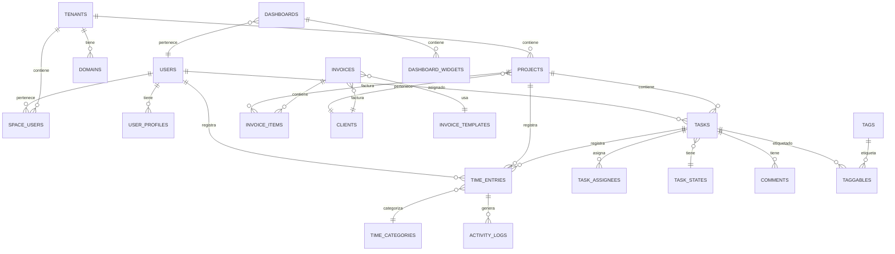

# EnkiFlow: Roadmap de Lanzamiento Acelerado

## Información del Documento
- **Versión:** 1.0
- **Fecha:** Mayo 2025
- **Enfoque:** Lanzamiento rápido al mercado
- **Responsable:** Equipo EnkiFlow

---

## Resumen Ejecutivo

Este roadmap presenta una estrategia acelerada para llevar EnkiFlow al mercado, priorizando el desarrollo de un Producto Mínimo Viable (MVP) con las funcionalidades esenciales que aporten valor inmediato a los usuarios, seguido de iteraciones rápidas basadas en feedback real. A diferencia del roadmap técnico completo, este plan se enfoca en:

1. Priorizar características de alto impacto para el usuario
2. Implementar ciclos de desarrollo ultracortos (1-2 semanas)
3. Aprovechar Claude y otras herramientas de IA para acelerar el desarrollo
4. Adoptar un enfoque de lanzamiento progresivo con usuarios reales
5. Integrar feedback y mejoras continuamente

La meta es tener un producto en manos de los primeros usuarios en **8 semanas** y una versión comercial completa en **20 semanas** (versus las 56 semanas del plan original).

---

## Modelo de Datos del Sistema

Basado en el análisis del proyecto existente y los requerimientos del roadmap acelerado, se ha diseñado el siguiente modelo de datos optimizado para Laravel 12:

### Diagrama de Entidad-Relación

### Estructura de Tablas Principales

#### Sistema Multi-tenant
- `users`: Usuarios del sistema con autenticación
- `user_profiles`: Información ampliada del perfil de usuario
- `tenants`: Espacios de trabajo (implementación multi-tenant)
- `domains`: Dominios asociados a cada tenant
- `space_users`: Relación entre usuarios y espacios con roles

#### Gestión de Proyectos
- `clients`: Clientes para los que se realizan proyectos
- `projects`: Proyectos con presupuesto y estado
- `task_states`: Estados personalizables para tareas
- `tasks`: Tareas con relaciones jerárquicas
- `task_assignees`: Asignación múltiple de usuarios a tareas

#### Seguimiento de Tiempo
- `time_categories`: Categorías para clasificar entradas de tiempo
- `time_entries`: Registro de tiempo con relaciones a proyectos/tareas
- `activity_logs`: Seguimiento detallado de actividad para detección automática

#### Reportes y Dashboards
- `dashboards`: Dashboards personalizables por usuario
- `dashboard_widgets`: Widgets configurables para dashboards
- `saved_reports`: Informes guardados con programación

#### Facturación
- `invoice_templates`: Plantillas personalizables de facturas
- `invoices`: Facturas con estado y totales
- `invoice_items`: Líneas detalladas de factura

#### Extensibilidad
- `tags` y `taggables`: Sistema de etiquetado polimórfico
- `comments`: Comentarios polimórficos para cualquier entidad
- `integrations`: Integraciones con servicios externos
- `webhook_endpoints`: Puntos de conexión para webhooks
- `activity_log`: Registro auditable de cambios en el sistema

Este modelo de datos está diseñado para optimizar el rendimiento, permitir escalar la aplicación, y facilitar la implementación de las funcionalidades prioritarias del MVP.

---

## Análisis de Mercado y Funcionalidades Prioritarias

Basado en investigación de mercado de las tendencias 2025 para aplicaciones de gestión de tareas y seguimiento de tiempo, estas son las funcionalidades clave que los usuarios esperan por categoría y rango de precio:

### 1. Gestión de Tareas (Tipo Todoist Enhanced)

**Funcionalidades Base (Plan Gratuito / Basic):**
- Sistema de tareas jerárquico con proyectos/listas y subtareas
- Vista de lista principal con opciones de ordenación básicas
- Fecha límite y prioridades (4 niveles)
- Etiquetas simples para categorización
- Filtros básicos (por fecha, proyecto, prioridad)
- Recordatorios básicos (una vez por tarea)
- Capacidad de comentarios en tareas
- Interfaz limpia y minimalista enfocada en la simplicidad

**Funcionalidades Pro (Plan Pagado Básico, ~$5-8/mes):**
- Vistas múltiples: Lista, Kanban, Calendario
- Tareas recurrentes con patrones complejos
- Campos personalizados para tareas
- Filtros y búsqueda avanzada
- Recordatorios múltiples y basados en ubicación
- Colaboración limitada (hasta 5 usuarios)
- Integración con calendario (Google, Outlook)
- Plantillas de proyectos reutilizables
- Priorización inteligente basada en fecha/importancia
- Seguimiento básico de hábitos

**Funcionalidades Business (Plan Empresarial, ~$12-15/mes):**
- Dependencias entre tareas
- Vista Gantt para proyectos complejos
- Colaboración ilimitada con roles y permisos
- Estado personalizable del flujo de trabajo
- Integración con 30+ herramientas externas
- Estadísticas de productividad y reportes
- Automatizaciones avanzadas con condiciones
- Tableros compartidos con clientes/externos
- Importación/exportación masiva
- API completa para personalización

### 2. Seguimiento de Tiempo

**Funcionalidades Base (Plan Gratuito / Basic):**
- Temporizador manual con botones iniciar/pausar/detener
- Asociación de tiempo a proyectos/tareas
- Historial básico de tiempo registrado
- Edición manual de entradas de tiempo
- Reporte simple (diario/semanal)
- Categorización básica del tiempo

**Funcionalidades Pro (Plan Pagado Básico):**
- Seguimiento automatizado con recordatorios
- Detección de inactividad
- Etiquetas y categorías personalizables
- Temporizador con descripción continua
- Informes visuales personalizables
- Exportación a formatos estándar (CSV, Excel)
- Temporizador desde múltiples dispositivos
- Tiempo estimado vs. real

**Funcionalidades Business:**
- Seguimiento automático de aplicaciones
- Integración con facturación
- Aprobaciones de tiempo registrado
- Costos y presupuestos por proyecto
- Múltiples tasas de facturación
- Reportes avanzados por cliente/proyecto/usuario
- Control de horas facturables vs. no facturables
- Reglas de redondeo personalizadas

### 3. Colaboración y Equipos

**Funcionalidades Base:**
- Espacios compartidos básicos
- Comentarios en tareas
- Notificaciones básicas de cambios
- Permisos simples (ver/editar)

**Funcionalidades Pro:**
- Asignación múltiple de tareas
- Notificaciones personalizables
- Estado de disponibilidad
- Roles ampliados (administrador, miembro, observador)
- Actividad de equipo en tiempo real
- Menciones (@usuario)

**Funcionalidades Business:**
- Controles de acceso basados en roles
- Espacios de trabajo aislados (multitenancy)
- Integración con directorio empresarial
- Auditoría de actividad
- Permisos granulares por proyecto
- Reglas de automatización por equipo
- Plantillas de equipos

### 4. Integración y Extensibilidad

**Funcionalidades Base:**
- Integración con calendario personal
- Email a tarea
- Extensión de navegador simple

**Funcionalidades Pro:**
- Integración bidireccional con Google/Outlook
- Webhooks básicos
- API limitada
- Integración con 10-15 servicios populares
- Sincronización entre dispositivos

**Funcionalidades Business:**
- API completa
- Webhooks avanzados
- Integraciones premium (Salesforce, Jira)
- SSO (inicio de sesión único)
- Conectores personalizados
- Automatización entre servicios

### 5. Análisis y Reportes

**Funcionalidades Base:**
- Vista de productividad simple
- Filtros básicos por fecha

**Funcionalidades Pro:**
- Informes personalizables
- Tablero de productividad personal
- Tendencias por semana/mes
- Exportación a formatos múltiples

**Funcionalidades Business:**
- Informes programados por email
- Métricas de productividad del equipo
- Exportación personalizada y white-label
- Tableros interactivos en tiempo real
- Análisis predictivo

### 6. UX/UI y Accesibilidad

**Expectativas generales:**
- Diseño responsivo para todos los dispositivos
- Modo oscuro/claro
- Accesos rápidos de teclado
- Tiempo de carga rápido (<2s)
- Interfaz minimalista pero potente
- Sincronización offline
- Adaptable a diferentes flujos de trabajo
- Personalización de la interfaz

### Tendencias 2025 a Incorporar

1. **Asistentes IA para productividad**
   - Categorización automática de tareas
   - Recomendaciones de priorización
   - Estimación inteligente de tiempo
   - Detección de patrones de productividad

2. **Integración trabajo-vida**
   - Gestión unificada de tareas personales y laborales
   - Prevención de burnout con métricas de equilibrio
   - Programación adaptativa según energía disponible

3. **Enfoque en bienestar**
   - Seguimiento de descansos (técnica pomodoro)
   - Recordatorios de pausas basados en patrones
   - Datos de productividad contextualizados

4. **Hiperpersonalización**
   - Flujos de trabajo adaptables por usuario
   - Interfaces configurables
   - Automatizaciones personalizadas

### Estrategia de Precios Competitiva (2025)

- **Free**: Funcionalidades básicas para usuarios individuales (límite de proyectos/tareas)
- **Pro**: $7-9/mes - Ideal para freelancers y profesionales (todas las funcionalidades personales)
- **Business**: $12-15/usuario/mes - Para equipos pequeños y medianos
- **Enterprise**: $18-25/usuario/mes - Para organizaciones grandes con necesidades complejas

Este análisis de mercado nos permite priorizar las funcionalidades para el MVP de EnkiFlow y garantizar que estemos alineados con las expectativas de los usuarios en 2025, ofreciendo un valor excepcional en cada nivel de precio.

---

## Backlog Técnico Detallado para el Desarrollo MVP

A continuación se presenta un backlog técnico detallado con tareas específicas desde una perspectiva de implementación Laravel 12, considerando todos los componentes del framework (migraciones, modelos, controladores, servicios, etc.).

### 1. Configuración de Infraestructura Base

#### 1.1 Configuración del Proyecto Laravel 12

##### 1.1.1 Inicialización del Proyecto Base
- **Duración estimada**: 1 día
- **Componentes técnicos**:
  - Crear proyecto base: `composer create-project laravel/laravel enkiflow "12.*"`
  - Configurar .env con variables de entorno para desarrollo
  - Implementar estructura de carpetas personalizada para modularización
  - Configurar composer.json con dependencias iniciales y scripts de automatización

##### 1.1.2 Configuración de Entorno de Desarrollo Containerizado
- **Duración estimada**: 1 día
- **Componentes técnicos**:
  - Implementar Laravel Sail: `php artisan sail:install --with=mysql,redis,mailpit,selenium`
  - Extender configuración de Docker con servicios adicionales en docker-compose.yml
  - Crear Dockerfile personalizado para extensiones PHP requeridas
  - Configurar volumen de datos persistentes y optimizaciones para desarrollo
  - Implementar scripts de inicialización y carga de datos semilla

##### 1.1.3 Implementación de Frontend SPA
- **Duración estimada**: 2 días
- **Componentes técnicos**:
  - Instalar Inertia.js: `composer require inertiajs/inertia-laravel`
  - Configurar Vue 3 con Composition API: `npm install @inertiajs/vue3`
  - Implementar middleware HandleInertiaRequests y sus personalizaciones
  - Configurar Vite con plugins para Vue, PostCSS y optimizaciones
  - Crear estructura base de layouts, componentes compartidos y páginas
  - Implementar sistema de gestión de estado con Pinia

#### 1.2 Implementación de Multi-tenancy

##### 1.2.1 Configuración del Framework de Multi-tenancy
- **Duración estimada**: 2 días
- **Componentes técnicos**:
  - Instalar paquete: `composer require stancl/tenancy:^3.7`
  - Publicar y personalizar configuración: `php artisan vendor:publish --tag=tenancy-config`
  - Configurar TenancyServiceProvider e implementar bootstrappers personalizados
  - Implementar modelo Tenant extendiendo de BaseTenant con propiedades extra
  - Configurar CacheManager personalizado para aislamiento de caché por tenant
  - Desarrollar middleware universal para tenants: `app/Http/Middleware/InitializeTenancyByDomain.php`

##### 1.2.2 Migraciones y Modelos en Sistema Multi-tenant
- **Duración estimada**: 3 días
- **Componentes técnicos**:
  - Crear migraciones centrales para `users`, `tenants` y `domains`
  - Implementar migraciones específicas de tenant con tag adecuado
  - Configurar directorio de migraciones separado: `database/migrations/tenant`
  - Implementar sistema de estados para migraciones de tenant: pendiente, migrado, fallido
  - Desarrollar Job para migraciones asíncronas: `app/Jobs/TenantMigrationJob.php`
  - Crear mecanismos de rollback de migraciones para tenants

##### 1.2.3 Gestión del Ciclo de Vida de Tenants
- **Duración estimada**: 3 días
- **Componentes técnicos**:
  - Implementar Listeners para eventos del ciclo de vida: TenantCreated, TenantDeleted, TenantUpdated
  - Crear proceso de provisionamiento: `app/Services/TenantProvisioningService.php`
  - Desarrollar mecanismo de inicialización con datos semilla personalizados por tenant
  - Implementar sistema de respaldo de datos por tenant
  - Crear tareas programadas para mantenimiento: `app/Console/Commands/TenantMaintenanceCommand.php`
  - Configurar rotación de logs específicos por tenant con contexto

#### 1.3 Sistema de Autenticación y Autorización

##### 1.3.1 Implementación del Sistema Base de Autenticación
- **Duración estimada**: 2 días
- **Componentes técnicos**:
  - Implementar Fortify: `composer require laravel/fortify`
  - Personalizar FortifyServiceProvider con features específicas
  - Crear ActionClass personalizada: `app/Actions/Fortify/CreateNewUser.php`
  - Configurar autenticación por múltiples campos (email/username)
  - Implementar Rate Limiting personalizado para intentos de login
  - Configurar middleware de autenticación en 2 factores: `app/Http/Middleware/RequireTwoFactorAuth.php`

##### 1.3.2 Sistema de Roles y Permisos
- **Duración estimada**: 3 días
- **Componentes técnicos**:
  - Instalar Spatie Permissions: `composer require spatie/laravel-permission`
  - Crear migración personalizada para roles específicos del sistema
  - Implementar seeder de roles y permisos: `database/seeders/RolesAndPermissionsSeeder.php`
  - Desarrollar middleware para verificación de permisos: `app/Http/Middleware/CheckPermissions.php`
  - Crear helpers para verificación rápida: `app/Helpers/PermissionHelpers.php`
  - Implementar caché de permisos con Redis
  - Desarrollar UI para asignación de permisos

##### 1.3.3 Autenticación Social y SSO
- **Duración estimada**: 2 días
- **Componentes técnicos**:
  - Instalar Socialite: `composer require laravel/socialite`
  - Configurar proveedores OAuth en `config/services.php`
  - Implementar controladores para callback: `app/Http/Controllers/Auth/SocialLoginController.php`
  - Crear sistema de vinculación de cuentas sociales a cuentas existentes
  - Desarrollar middleware para autenticación OAuth con tenant
  - Implementar token storage seguro para proveedores

### 2. Desarrollo del Sistema de Gestión de Tareas

#### 2.1 Modelos y Migraciones

##### 2.1.1 Diseño e Implementación de Esquema de Base de Datos
- **Duración estimada**: 3 días
- **Componentes técnicos**:
  - Crear migraciones para tabla base: `database/migrations/tenant/create_task_states_table.php`
  - Diseñar migración para proyectos: `database/migrations/tenant/create_projects_table.php`
  - Implementar migración para tareas: `database/migrations/tenant/create_tasks_table.php`
  - Desarrollo de migración para sistema de etiquetas: `database/migrations/tenant/create_tags_table.php`
  - Implementar tabla polimorfica para taggables: `database/migrations/tenant/create_taggables_table.php`
  - Diseño de tabla pivot para asignaciones: `database/migrations/tenant/create_task_assignees_table.php`
  - Migración para comentarios: `database/migrations/tenant/create_comments_table.php`
  - Crear índices optimizados para búsquedas frecuentes y relaciones

##### 2.1.2 Desarrollo de Modelos Eloquent y Relaciones
- **Duración estimada**: 3 días
- **Componentes técnicos**:
  - Implementar modelo Project: `app/Models/Project.php`
    - Traits: HasFactory, SoftDeletes, HasTags, Auditable
    - Relaciones: belongsTo(Client), hasMany(Task), belongsTo(User), morphMany(Comments)
    - Scopes: priority(), recent(), upcoming(), overdue()
    - Mutators/Accessors para fechas y estados
  - Crear modelo Task: `app/Models/Task.php`
    - Traits: HasFactory, SoftDeletes, HasTags, Auditable
    - Relaciones: belongsTo(Project), belongsTo(User), morphMany(Comments), belongsToMany(User, 'task_assignees')
    - Sistema recurrente con definición de patrones en JSON
    - Métodos para estimación vs. tiempo real
  - Implementar modelo TaskState: `app/Models/TaskState.php`
    - Configuración para máquina de estados
    - Sistema de transiciones permitidas en JSON
  - Modelo Tag: `app/Models/Tag.php` con relaciones polimórficas
  - Crear clase base Observer: `app/Observers/BaseModelObserver.php`
  - Implementar observers específicos: TaskObserver, ProjectObserver
  - Registrar observers en EventServiceProvider

##### 2.1.3 Implementación de Seeders y Factories
- **Duración estimada**: 2 días
- **Componentes técnicos**:
  - Desarrollar factory para proyectos: `database/factories/ProjectFactory.php`
  - Crear factory para tareas: `database/factories/TaskFactory.php`
  - Crear factory para estados: `database/factories/TaskStateFactory.php`
  - Desarrollar seeder para estados por defecto: `database/seeders/TaskStateSeeder.php`
  - Crear seeder para proyectos demo: `database/seeders/DemoProjectSeeder.php`
  - Implementar seeder maestro para tenants: `database/seeders/TenantSeeder.php`

#### 2.2 API RESTful y Servicios

##### 2.2.1 Desarrollo de Controllers y Resources
- **Duración estimada**: 4 días
- **Componentes técnicos**:
  - Crear controlador base: `app/Http/Controllers/Api/ApiController.php`
  - Implementar controlador de proyectos: `app/Http/Controllers/Api/ProjectController.php`
  - Desarrollar controlador de tareas: `app/Http/Controllers/Api/TaskController.php`
  - Crear controlador de estados: `app/Http/Controllers/Api/TaskStateController.php`
  - Implementar API Resources:
    - `app/Http/Resources/ProjectResource.php`
    - `app/Http/Resources/ProjectCollection.php`
    - `app/Http/Resources/TaskResource.php`
    - `app/Http/Resources/TaskCollection.php`
    - `app/Http/Resources/TaskStateResource.php`
  - Desarrollar FormRequests para validación:
    - `app/Http/Requests/StoreProjectRequest.php`
    - `app/Http/Requests/UpdateProjectRequest.php`
    - `app/Http/Requests/StoreTaskRequest.php`
    - `app/Http/Requests/UpdateTaskRequest.php`
    - `app/Http/Requests/ReorderTasksRequest.php`
  
##### 2.2.2 Implementación de Servicios para Lógica de Negocio
- **Duración estimada**: 3 días
- **Componentes técnicos**:
  - Crear interfaz de servicio base: `app/Services/Contracts/CrudServiceInterface.php`
  - Implementar servicio base abstracto: `app/Services/AbstractCrudService.php`
  - Desarrollar servicios específicos:
    - `app/Services/ProjectService.php`
    - `app/Services/TaskService.php`
    - `app/Services/TaskStateService.php`
  - Implementar Events y Listeners para operaciones importantes:
    - `app/Events/TaskCreated.php`
    - `app/Events/TaskCompleted.php`
    - `app/Events/TaskAssigned.php`
    - `app/Listeners/SendTaskNotification.php`
    - `app/Listeners/CreateTimeEntryForCompletedTask.php`
  - Registrar servicios en ServiceProvider personalizado: `app/Providers/TaskServiceProvider.php`

##### 2.2.3 Queries, Filtros y Paginación
- **Duración estimada**: 3 días
- **Componentes técnicos**:
  - Instalar paquete: `composer require spatie/laravel-query-builder`
  - Crear clases de filtro personalizadas:
    - `app/Filters/TaskFilter.php`
    - `app/Filters/ProjectFilter.php`
  - Implementar Builder personalizado: `app/QueryBuilder/EnkiQueryBuilder.php`
  - Desarrollar sistema de ordenación personalizado: `app/QueryBuilder/Sorts`
  - Implementar cache de consultas frecuentes con tags de Redis
  - Configurar paginación con cursor para grandes conjuntos de datos
  - Crear transformer para respuestas paginadas: `app/Transformers/PaginatedResourceTransformer.php`

#### 2.3 Sistema Kanban y Frontend

##### 2.3.1 Implementación de Componentes Vue para Kanban
- **Duración estimada**: 5 días
- **Componentes técnicos**:
  - Instalar Vue Draggable: `npm install vuedraggable@next`
  - Crear store Pinia para tareas: `resources/js/stores/taskStore.js`
  - Desarrollar componente base Kanban: `resources/js/Components/Kanban/KanbanBoard.vue`
  - Implementar componente de columna: `resources/js/Components/Kanban/KanbanColumn.vue`
  - Crear componente de tarjeta: `resources/js/Components/Kanban/TaskCard.vue`
  - Desarrollar modal de detalle: `resources/js/Components/Kanban/TaskDetailModal.vue`
  - Implementar formulario de tarea: `resources/js/Components/Kanban/TaskForm.vue`
  - Crear Composables reutilizables:
    - `resources/js/Composables/useDragDrop.js`
    - `resources/js/Composables/useTaskCRUD.js`
    - `resources/js/Composables/useTaskFilters.js`

##### 2.3.2 Sistema de Actualización en Tiempo Real
- **Duración estimada**: 3 días
- **Componentes técnicos**:
  - Instalar Echo y Socket.io: `npm install laravel-echo socket.io-client`
  - Configurar broadcasting en Laravel: `config/broadcasting.php`
  - Crear canales privados por tenant: `routes/channels.php`
  - Implementar event broadcasts para cambios en tareas
  - Desarrollar middleware WebSocket para autenticación con tenant
  - Crear componente de notificación en tiempo real: `resources/js/Components/RealTimeNotifications.vue`
  - Implementar servicio Ably o Pusher: `config/websockets.php`

##### 2.3.3 Interfaz de Filtrado y Búsqueda
- **Duración estimada**: 3 días
- **Componentes técnicos**:
  - Crear componente de filtro combinado: `resources/js/Components/TaskFilter.vue`
  - Implementar búsqueda instantánea con debounce
  - Desarrollar selector de filtro avanzado: `resources/js/Components/AdvancedFilterSelector.vue`
  - Guardar preferencias de filtro en LocalStorage/Cookies
  - Crear endpoints para búsqueda global: `app/Http/Controllers/Api/SearchController.php`
  - Implementar servicio de indexación para búsqueda: `app/Services/SearchService.php`

#### 2.4 Máquina de Estados y Automatización

##### 2.4.1 Implementación de Máquina de Estados
- **Duración estimada**: 4 días
- **Componentes técnicos**:
  - Instalar paquete de estados: `composer require spatie/laravel-model-states`
  - Crear clase base de estado: `app/States/Task/TaskState.php`
  - Implementar estados concretos:
    - `app/States/Task/Backlog.php`
    - `app/States/Task/InProgress.php`
    - `app/States/Task/UnderReview.php`
    - `app/States/Task/Completed.php`
    - `app/States/Task/Cancelled.php`
  - Definir transiciones permitidas: `app/States/Task/TaskStateTransition.php`
  - Crear middleware de validación de transiciones
  - Desarrollar observers para cambios de estado

##### 2.4.2 Automatizaciones y Reglas de Negocio
- **Duración estimada**: 4 días
- **Componentes técnicos**:
  - Crear sistema de reglas base: `app/Rules/BaseTaskRule.php`
  - Implementar motor de reglas: `app/Services/RuleEngine.php`
  - Desarrollar reglas específicas:
    - `app/Rules/AutoAssignToCreator.php`
    - `app/Rules/NotifyOnDueDateApproaching.php`
    - `app/Rules/CreateDependentTasksOnCompletion.php`
  - Crear interfaz de reglas en JSON: `app/Http/Controllers/Api/TaskRuleController.php`
  - Implementar Jobs para verificación de reglas: `app/Jobs/ProcessTaskRulesJob.php`
  - Crear comandos de mantenimiento: `app/Console/Commands/ProcessPendingTaskRulesCommand.php`

##### 2.4.3 Sistema de Plantillas Reutilizables
- **Duración estimada**: 3 días
- **Componentes técnicos**:
  - Crear migración para plantillas: `database/migrations/tenant/create_task_templates_table.php`
  - Implementar modelo de plantilla: `app/Models/TaskTemplate.php`
  - Desarrollar servicio de plantillas: `app/Services/TemplateService.php`
  - Crear interfaz de generación desde plantilla: `resources/js/Pages/Templates/Index.vue`
  - Implementar sistema de clone recursivo para proyectos y tareas
  - Desarrollar API para operaciones de plantilla

### 3. Desarrollo del Sistema de Seguimiento de Tiempo

#### 3.1 Modelos y Estructura de Datos

##### 3.1.1 Diseño e Implementación de Esquema de Base de Datos
- **Duración estimada**: 3 días
- **Componentes técnicos**:
  - Crear migración para entradas de tiempo: `database/migrations/tenant/create_time_entries_table.php`
  - Implementar migración para categorías: `database/migrations/tenant/create_time_categories_table.php`
  - Diseñar migración para registro de actividad: `database/migrations/tenant/create_activity_logs_table.php`
  - Crear índices compuestos para consultas de reportes
  - Implementar campos JSON para metadata extensible
  - Diseñar sistema de particionamiento para datos históricos

##### 3.1.2 Desarrollo de Modelos y Relaciones
- **Duración estimada**: 3 días
- **Componentes técnicos**:
  - Implementar modelo TimeEntry: `app/Models/TimeEntry.php`
    - Traits: HasFactory, SoftDeletes, Auditable
    - Relaciones: belongsTo(User), belongsTo(Task), belongsTo(Project), belongsTo(TimeCategory)
    - Scopes: billable(), nonBillable(), running(), completed(), dateRange()
    - Mutators/Accessors para duración y estado
  - Crear modelo TimeCategory: `app/Models/TimeCategory.php`
  - Implementar modelo ActivityLog: `app/Models/ActivityLog.php`
  - Desarrollar observers para modelos de tiempo
  - Crear QueryScopes para reportes comunes

##### 3.1.3 Validación y Reglas de Negocio
- **Duración estimada**: 2 días
- **Componentes técnicos**:
  - Crear validadores personalizados: `app/Rules/NoOverlappingTimeEntries.php`
  - Implementar validación para duración máxima: `app/Rules/MaxDuration.php`
  - Desarrollar validación de entradas futuras: `app/Rules/NoFutureTimeEntries.php`
  - Crear sistema de autorización para edición de tiempo: `app/Policies/TimeEntryPolicy.php`

#### 3.2 Sistema de Temporizador

##### 3.2.1 Desarrollo de Backend para Temporizador
- **Duración estimada**: 3 días
- **Componentes técnicos**:
  - Crear controlador de tiempo: `app/Http/Controllers/Api/TimeEntryController.php`
  - Implementar endpoint para iniciar temporizador: `POST /api/time-entries/start`
  - Desarrollar endpoint para pausar: `PUT /api/time-entries/{id}/pause`
  - Crear endpoint para reanudar: `PUT /api/time-entries/{id}/resume`
  - Implementar endpoint para detener: `PUT /api/time-entries/{id}/stop`
  - Desarrollar servicio de temporizador: `app/Services/TimeTrackerService.php`
  - Implementar sistema de bloqueo con Redis para evitar conflictos

##### 3.2.2 Componentes Frontend para Temporizador
- **Duración estimada**: 4 días
- **Componentes técnicos**:
  - Crear store Pinia para tiempo: `resources/js/stores/timeEntryStore.js`
  - Desarrollar componente de temporizador: `resources/js/Components/TimeTracker/Timer.vue`
  - Implementar selector de tarea/proyecto: `resources/js/Components/TimeTracker/TaskSelector.vue`
  - Crear componente de descripción continua: `resources/js/Components/TimeTracker/DescriptionInput.vue`
  - Desarrollar indicador de estado: `resources/js/Components/TimeTracker/StatusIndicator.vue`
  - Implementar componente de categoría: `resources/js/Components/TimeTracker/CategorySelector.vue`
  - Crear composables para funcionalidad de temporizador:
    - `resources/js/Composables/useTimer.js`
    - `resources/js/Composables/useLocalStorageBackup.js`

##### 3.2.3 Detección de Inactividad y Sincronización
- **Duración estimada**: 3 días
- **Componentes técnicos**:
  - Desarrollar servicio de detección de inactividad: `resources/js/Services/InactivityDetector.js`
  - Implementar sincronización periódica: `resources/js/Services/TimeEntrySyncService.js`
  - Crear sistema de manejo de desconexiones
  - Implementar caché offline con IndexedDB
  - Desarrollar estrategia de resolución de conflictos

#### 3.3 Reportes e Integración

##### 3.3.1 Desarrollo de Sistema de Reportes
- **Duración estimada**: 5 días
- **Componentes técnicos**:
  - Crear servicio de reportes: `app/Services/TimeReportService.php`
  - Implementar caché de consultas frecuentes con Redis tags
  - Desarrollar API para reportes: `app/Http/Controllers/Api/TimeReportController.php`
  - Crear consultas optimizadas con sum(), groupBy() y having()
  - Implementar Report DTO: `app/DataTransferObjects/TimeReportDTO.php`
  - Desarrollar Jobs para generación de reportes pesados: `app/Jobs/GenerateTimeReportJob.php`
  - Crear comandos de generación programada: `app/Console/Commands/GenerateWeeklyReportCommand.php`

##### 3.3.2 Visualización y UI de Reportes
- **Duración estimada**: 4 días
- **Componentes técnicos**:
  - Instalar Chart.js: `npm install chart.js vue-chartjs`
  - Crear componentes de gráficos: 
    - `resources/js/Components/Charts/TimeBarChart.vue`
    - `resources/js/Components/Charts/ProjectDistributionChart.vue`
    - `resources/js/Components/Charts/ProductivityTimelineChart.vue`
  - Implementar filtros dinámicos: `resources/js/Components/TimeFilter.vue`
  - Desarrollar vista de tabla: `resources/js/Components/TimeEntryTable.vue`
  - Crear UI para comparativa: `resources/js/Pages/Reports/Compare.vue`
  - Implementar exportación PDF/CSV

##### 3.3.3 Integración con Facturación
- **Duración estimada**: 3 días
- **Componentes técnicos**:
  - Crear migración para tasas horarias: `database/migrations/tenant/create_hourly_rates_table.php`
  - Desarrollar modelo de tasa: `app/Models/HourlyRate.php`
  - Implementar reglas para tiempo facturable/no facturable
  - Crear servicio de facturación: `app/Services/InvoiceService.php`
  - Desarrollar API para extracción de tiempo facturable: `app/Http/Controllers/Api/BillableTimeController.php`
  - Implementar sistema de agrupación para facturas

### 4. Sistema de Colaboración y Equipos

#### 4.1 Gestión de Equipos y Espacios de Trabajo

##### 4.1.1 Sistema de Invitaciones y Pertenencia a Equipos
- **Duración estimada**: 3 días
- **Componentes técnicos**:
  - Crear migración para invitaciones: `database/migrations/central/create_invitations_table.php`
  - Implementar modelo de invitación: `app/Models/Invitation.php`
  - Desarrollar servicio de invitación: `app/Services/InvitationService.php`
  - Crear controlador de invitaciones: `app/Http/Controllers/Api/InvitationController.php`
  - Implementar sistema de tokens JWT para invitaciones
  - Desarrollar eventos y listeners: 
    - `app/Events/InvitationSent.php`
    - `app/Events/InvitationAccepted.php`
    - `app/Listeners/SendInvitationEmail.php`
  - Crear vistas de email para invitaciones: `resources/views/emails/invitations`

##### 4.1.2 Gestión de Roles y Permisos por Espacio
- **Duración estimada**: 4 días
- **Componentes técnicos**:
  - Extender tabla space_users: `database/migrations/central/alter_space_users_add_permissions.php`
  - Desarrollar middleware de roles por tenant: `app/Http/Middleware/EnsureTenantRole.php`
  - Implementar UI de gestión de miembros: `resources/js/Pages/Teams/Members.vue`
  - Crear controlador de miembros: `app/Http/Controllers/Api/TeamMemberController.php`
  - Desarrollar sistema de cambio de roles con validación
  - Implementar cache de roles por tenant en Redis

##### 4.1.3 Auditoría y Registro de Actividad
- **Duración estimada**: 3 días
- **Componentes técnicos**:
  - Instalar Laravel Auditing: `composer require owen-it/laravel-auditing`
  - Crear migración para logs de auditoría: `database/migrations/tenant/create_audit_logs_table.php`
  - Configurar modelos auditables con traits específicos
  - Implementar middleware para contexto de usuario en auditoría
  - Desarrollar UI para visualización de historial de cambios: `resources/js/Pages/Logs/AuditTrail.vue`
  - Crear filtros y búsqueda para logs de auditoría

#### 4.2 Sistema de Notificaciones

##### 4.2.1 Implementación de Canales de Notificación
- **Duración estimada**: 3 días
- **Componentes técnicos**:
  - Diseñar migración para preferencias: `database/migrations/tenant/create_notification_preferences_table.php`
  - Crear notificaciones base:
    - `app/Notifications/TaskAssigned.php`
    - `app/Notifications/TaskDueSoon.php`
    - `app/Notifications/TimeEntryReminder.php`
    - `app/Notifications/TeamInvitation.php`
  - Configurar múltiples canales: DatabaseChannel, MailChannel, WebPushChannel
  - Implementar serialización para notificaciones 
  - Desarrollar sistema de traducciones para notificaciones

##### 4.2.2 Notificaciones en Tiempo Real (WebSockets)
- **Duración estimada**: 4 días
- **Componentes técnicos**:
  - Configurar Laravel Echo Server o Laravel Websockets
  - Implementar evento BroadcastNotificationCreated
  - Crear canal privado por usuario: `channels.php`
  - Desarrollar middleware para autenticación de websockets
  - Implementar componente de notificaciones en tiempo real: `resources/js/Components/RealTimeNotifications.vue`
  - Crear servicio de conexión WebSocket: `resources/js/Services/WebSocketService.js`

##### 4.2.3 Centro de Notificaciones y Preferencias
- **Duración estimada**: 3 días
- **Componentes técnicos**:
  - Diseñar UI de centro de notificaciones: `resources/js/Pages/Notifications/Index.vue`
  - Crear panel de preferencias por tipo y canal: `resources/js/Pages/Notifications/Preferences.vue`
  - Implementar controladores para gestión de preferencias: `app/Http/Controllers/Api/NotificationPreferenceController.php`
  - Desarrollar sistema de marcado como leído/no leído
  - Implementar reglas de agrupación y priorización de notificaciones

### 5. Integraciones y API

#### 5.1 Integraciones con Servicios Externos

##### 5.1.1 Integración con Google Calendar
- **Duración estimada**: 4 días
- **Componentes técnicos**:
  - Instalar cliente de Google API: `composer require google/apiclient`
  - Implementar servicio OAuth: `app/Services/Google/GoogleAuthService.php`
  - Crear servicio de calendario: `app/Services/Google/GoogleCalendarService.php`
  - Desarrollar endpoints de autorización: `app/Http/Controllers/Api/Integrations/GoogleController.php`
  - Implementar sincronización bidireccional de eventos: `app/Jobs/SyncGoogleCalendarJob.php`
  - Crear UI para configuración de sincronización: `resources/js/Pages/Integrations/Google.vue`

##### 5.1.2 Integración con Microsoft/Outlook
- **Duración estimada**: 4 días
- **Componentes técnicos**:
  - Instalar SDK de Microsoft Graph: `composer require microsoft/microsoft-graph`
  - Crear servicio de autenticación: `app/Services/Microsoft/MicrosoftAuthService.php`
  - Implementar servicio de calendario: `app/Services/Microsoft/OutlookCalendarService.php`
  - Crear trabajo programado para sincronización: `app/Jobs/SyncOutlookCalendarJob.php`
  - Desarrollar UI para autorizar y configurar: `resources/js/Pages/Integrations/Microsoft.vue`

##### 5.1.3 Integración con Slack
- **Duración estimada**: 3 días
- **Componentes técnicos**:
  - Instalar cliente Slack: `composer require slack/slack`
  - Crear servicio de Slack: `app/Services/Slack/SlackIntegrationService.php`
  - Implementar Slash Commands para interactuar con tareas
  - Desarrollar notificaciones via Slack: `app/Notifications/Channels/SlackChannel.php`
  - Crear webhook para eventos de Slack: `app/Http/Controllers/Api/Webhooks/SlackController.php`

#### 5.2 API Pública y Webhooks

##### 5.2.1 Implementación de API RESTful
- **Duración estimada**: 5 días
- **Componentes técnicos**:
  - Instalar Laravel Passport: `composer require laravel/passport`
  - Configurar esquema OAuth: `app/Providers/AuthServiceProvider.php`
  - Implementar controladores públicos:
    - `app/Http/Controllers/Api/Public/TaskController.php`
    - `app/Http/Controllers/Api/Public/TimeEntryController.php`
    - `app/Http/Controllers/Api/Public/ProjectController.php`
  - Crear middleware para manejo de scopes: `app/Http/Middleware/CheckApiScope.php`
  - Implementar rate limiting con Redis: `app/Http/Middleware/ThrottlePublicApi.php`
  - Desarrollar sistema de versionado de API

##### 5.2.2 Documentación de API con OpenAPI/Swagger
- **Duración estimada**: 3 días
- **Componentes técnicos**:
  - Instalar L5-Swagger: `composer require darkaonline/l5-swagger`
  - Crear anotaciones en controladores públicos
  - Implementar generación automática de documentación: `php artisan l5-swagger:generate`
  - Desarrollar SDK cliente en JavaScript
  - Crear ejemplos y guías de uso

##### 5.2.3 Sistema de Webhooks
- **Duración estimada**: 4 días
- **Componentes técnicos**:
  - Crear migración para webhooks: `database/migrations/tenant/create_webhook_endpoints_table.php`
  - Implementar modelo: `app/Models/WebhookEndpoint.php`
  - Desarrollar servicio de envío de webhooks: `app/Services/WebhookService.php`
  - Crear sistema de reintentos con exponential backoff
  - Implementar firma digital de payloads para seguridad
  - Crear UI para configuración de webhooks: `resources/js/Pages/Developers/Webhooks.vue`

### 6. Performance y Escalabilidad

#### 6.1 Optimización de Base de Datos

##### 6.1.1 Optimización de Consultas y Relaciones
- **Duración estimada**: 3 días
- **Componentes técnicos**:
  - Implementar Global Scopes para tenant: `app/Models/Scopes/TenantScope.php`
  - Configurar eager loading automático para relaciones frecuentes
  - Crear índices compuestos para consultas comunes
  - Implementar actualizaciones por lotes para operaciones masivas
  - Desarrollar DTOs para transformación eficiente de datos: `app/DataTransferObjects`

##### 6.1.2 Caché y Almacenamiento en Redis
- **Duración estimada**: 3 días
- **Componentes técnicos**:
  - Configurar Redis con Tenancy: `config/tenancy-redis.php`
  - Implementar sistema de tags por tenant en caché
  - Desarrollar invalidación selectiva de caché
  - Crear caché de consultas de reportes con TTL variable
  - Implementar almacenamiento distribuido para sesiones y caché

##### 6.1.3 Particionamiento y Escalamiento
- **Duración estimada**: 4 días
- **Componentes técnicos**:
  - Diseñar estrategia de particionamiento para tablas grandes (`time_entries`, `activity_logs`)
  - Implementar rotación y archivado de datos históricos
  - Crear sistema de consulta cross-partition
  - Desarrollar migraciones para soporte de sharding

#### 6.2 Sistema de Colas y Trabajos en Segundo Plano

##### 6.2.1 Implementación de Laravel Horizon
- **Duración estimada**: 2 días
- **Componentes técnicos**:
  - Instalar Laravel Horizon: `composer require laravel/horizon`
  - Configurar workers con balanceo automático
  - Implementar colas diferenciadas por tipo de trabajo
  - Crear dashboard de monitoreo para trabajos
  - Implementar alertas para fallos de trabajos

##### 6.2.2 Trabajos Programados y Mantenimiento
- **Duración estimada**: 3 días
- **Componentes técnicos**:
  - Crear comandos para tareas programadas:
    - `app/Console/Commands/ProcessTimeEntriesForInvoicesCommand.php`
    - `app/Console/Commands/SendTaskRemindersCommand.php`
    - `app/Console/Commands/SyncCalendarIntegrationsCommand.php`
    - `app/Console/Commands/CleanupOldTimeEntriesCommand.php`
  - Implementar scheduler con tenancy: `app/Console/Kernel.php`
  - Desarrollar trabajos recurrentes con Horizon
  - Crear sistema de bloqueos distribuidos para evitar ejecuciones simultáneas

### 7. Pruebas y Aseguramiento de Calidad

#### 7.1 Testing Automatizado

##### 7.1.1 Tests Unitarios y de Integración
- **Duración estimada**: 5 días
- **Componentes técnicos**:
  - Configurar PHPUnit para multi-tenancy: `phpunit.xml`
  - Crear TestCase base con soporte para tenant: `tests/TestCase.php`
  - Implementar factories para todos los modelos
  - Desarrollar tests para servicios críticos:
    - `tests/Unit/Services/TimeTrackerServiceTest.php`
    - `tests/Unit/Services/TaskServiceTest.php`
  - Crear tests de API: `tests/Feature/Api`
  - Implementar tests de integración para flujos completos

##### 7.1.2 Tests de UI y Experiencia de Usuario
- **Duración estimada**: 4 días
- **Componentes técnicos**:
  - Instalar Laravel Dusk: `composer require --dev laravel/dusk`
  - Configurar entorno para pruebas de browser
  - Crear tests para flujos críticos: 
    - `tests/Browser/TimeTracking/TimerTest.php`
    - `tests/Browser/Tasks/KanbanBoardTest.php`
  - Implementar capturas de pantalla automáticas para fallos
  - Desarrollar helpers para interacciones comunes

##### 7.1.3 CI/CD y Automatización de Pruebas
- **Duración estimada**: 3 días
- **Componentes técnicos**:
  - Configurar GitHub Actions: `.github/workflows/test.yml`
  - Implementar pipeline de CD con despliegue automático
  - Crear matriz de pruebas para diferentes versiones de PHP/Node
  - Implementar reporte de cobertura de código
  - Configurar alertas para fallos de CI

#### 7.2 Código de Calidad

##### 7.2.1 Herramientas de Análisis Estático
- **Duración estimada**: 2 días
- **Componentes técnicos**:
  - Instalar PHP CS Fixer: `composer require --dev friendsofphp/php-cs-fixer`
  - Configurar PHPStan para análisis estático: `composer require --dev phpstan/phpstan`
  - Implementar reglas personalizadas de estilo
  - Crear scripts de pre-commit hooks
  - Integrar Code Climate para métricas continuas

##### 7.2.2 Documentación y Guías de Desarrollo
- **Duración estimada**: 3 días
- **Componentes técnicos**:
  - Crear documentación de API con PHPDoc
  - Implementar sistema de documentación automática
  - Desarrollar guías de contribución: `CONTRIBUTING.md`
  - Crear manuales de desarrollo: `docs/`

### 8. Monitoreo y Operaciones

#### 8.1 Logging y Trazabilidad

##### 8.1.1 Sistema de Logs Centralizados
- **Duración estimada**: 3 días
- **Componentes técnicos**:
  - Configurar formato estructurado de logs: `config/logging.php`
  - Implementar contexto de tenant en logs
  - Desarrollar driver personalizado para logs: `app/Logging/TenantLogDriver.php`
  - Configurar envío a servicio externo (Papertrail/ELK)
  - Implementar niveles dinámicos de log

##### 8.1.2 Sistema de Monitoreo de Aplicación
- **Duración estimada**: 3 días
- **Componentes técnicos**:
  - Instalar Laravel Telescope para desarrollo
  - Configurar monitorización de producción con New Relic
  - Implementar rastreo de excepciones con Bugsnag/Sentry
  - Desarrollar health checks para todos los servicios: `app/Http/Controllers/HealthCheckController.php`
  - Crear alertas para problemas críticos

##### 8.1.3 Dashboards de Estado
- **Duración estimada**: 2 días
- **Componentes técnicos**:
  - Crear dashboard de estado del sistema: `resources/js/Pages/Admin/SystemStatus.vue`
  - Implementar métricas en tiempo real con WebSockets
  - Desarrollar API para estadísticas de sistema
  - Crear indicadores de salud por servicio y tenant

---

## Fases de Desarrollo y Lanzamiento

### FASE 1: PREPARACIÓN MVP (SEMANAS 1-2)
**Objetivo:** Definir alcance mínimo viable y preparar infraestructura base

#### Tarea 1.1: Definición del MVP
- **Responsable:** Product Owner + Equipo Técnico
- **Duración:** 2 días
- **Descripción:** Definir conjunto mínimo de características para el primer lanzamiento
- **Pasos para Claude:**
  - Revisar ROADMAP.md original y extraer características esenciales
  - Priorizar funcionalidades según valor para usuario vs. esfuerzo de implementación
  - Generar documento de alcance del MVP con justificación de inclusiones/exclusiones
  - Crear historias de usuario simplificadas para las características del MVP

#### Tarea 1.2: Configuración de Infraestructura Base
- **Responsable:** DevOps + Desarrollador Backend
- **Duración:** 3 días
- **Descripción:** Configurar entornos de desarrollo, staging y producción
- **Pasos para Claude:**
  - Generar configuraciones de CI/CD simplificadas
  - Crear scripts de despliegue automatizados
  - Configurar monitorización básica
  - Documentar proceso de despliegue para el equipo

#### Tarea 1.3: Arquitectura Simplificada
- **Responsable:** Arquitecto de Software
- **Duración:** 3 días
- **Descripción:** Definir arquitectura ligera pero escalable
- **Pasos para Claude:**
  - Simplificar el diseño de patrones repositorio y servicio original
  - Crear diagrama de arquitectura MVP con componentes clave
  - Documentar decisiones de arquitectura y trade-offs
  - Identificar puntos de extensión para futuras iteraciones

### FASE 2: DESARROLLO CORE MVP (SEMANAS 3-6)
**Objetivo:** Implementar funcionalidades esenciales del MVP

## FUNCIONALIDADES DEL MVP

De acuerdo con la investigación de mercado actual, las siguientes características son prioritarias para el MVP, seleccionadas por su alto valor para el usuario y viabilidad de implementación rápida en Laravel 12:

1. **Seguimiento de Tiempo**
   - Temporizador manual iniciar/pausar/detener con un solo clic (siguiendo tendencias de Toggl)
   - Entrada manual de tiempo retroactiva
   - Categorización por proyecto/tarea/etiqueta
   - Detección básica de inactividad
   - Historial de tiempo con búsqueda y filtrado
   - Vista personalizable diaria/semanal/mensual
   - Notificaciones de recordatorio configurable
   
2. **Gestión de Proyectos Simple**
   - Estructura jerárquica: proyectos → tareas → subtareas
   - Proyectos con metadatos: cliente, estado, fecha límite, presupuesto de horas
   - Tareas con título, descripción, estado, prioridad y estimación
   - Asignación múltiple de usuarios a tareas
   - Vista de lista, tablero Kanban y calendario
   - Filtros y búsqueda avanzada con Eloquent
   - Plantillas de proyecto reutilizables
   
3. **Gestión de Equipos Multi-tenant**
   - Espacios de trabajo aislados con tenant ID (usando paquete spatie/laravel-multitenancy)
   - Sistema de invitación por email con tokens seguros
   - Roles y permisos granulares (usando spatie/laravel-permission)
   - Perfiles de usuario con preferencias personalizables
   - Actividad de equipo en tiempo real con Laravel Echo

4. **Reportes y Analytics**
   - Dashboard personalizable con widgets de arrastrar y soltar
   - Gráficos visuales de tiempo por proyecto/cliente/usuario
   - Informes de productividad y utilización
   - Exportación a formatos CSV, PDF y Excel
   - API endpoints para acceso a datos de informes
   - Reportes programados por email

5. **Experiencia de Usuario Moderna**
   - SPA con Laravel + Vue.js/React para interactividad máxima
   - Diseño responsivo basado en Tailwind CSS
   - Tema claro/oscuro configurable a nivel usuario
   - UX simplificada con reducción de clics para tareas frecuentes
   - Componentes accesibles siguiendo estándares WCAG
   - Rendimiento optimizado con lazy loading y cache

6. **Integraciones Esenciales**
   - Autenticación OAuth 2.0 con Google y Microsoft
   - Webhooks para eventos principales del sistema
   - API RESTful documentada con Laravel Sanctum
   - Integración con Slack para notificaciones
   - Exportación a herramientas de facturación

#### Tarea 2.1: Implementación del Sistema de Seguimiento de Tiempo
- **Responsable:** Desarrollador Frontend + Backend
- **Duración:** 5 días
- **Descripción:** Desarrollar un sistema completo de seguimiento de tiempo con Laravel 12
- **Características específicas:**
  - Temporizador interactivo con controles iniciar/pausar/detener mediante LiveWire
  - Entrada manual con validación de tiempo para registros retroactivos
  - Detección automática de inactividad con JavaScript
  - Registro de tiempo categorizado por proyecto/tarea con relaciones Eloquent
  - Historial con filtros avanzados y paginación mediante Laravel Query Builder
  - Notificaciones en tiempo real con Laravel Echo y Pusher
- **Tareas técnicas Laravel:**
  - Crear migraciones para las tablas `time_entries`, `time_categories` y `time_tags`
  - Implementar modelos Eloquent con relaciones y scopes para filtrado eficiente
  - Desarrollar controladores RESTful con validación de formularios
  - Crear eventos transmitidos para actualización en tiempo real
  - Implementar un trabajador en segundo plano para procesamiento de registros automáticos
  - Configurar caché con Redis para datos frecuentemente accedidos
- **Pasos para Claude:**
  - Generar código de migración y modelos con relaciones Eloquent
  - Crear componentes LiveWire para el temporizador interactivo
  - Desarrollar controladores RESTful con validación de solicitudes
  - Implementar lógica de negocio en clases de servicio
  - Escribir pruebas unitarias y de integración

#### Tarea 2.2: Sistema de Gestión de Proyectos y Tareas
- **Responsable:** Desarrollador Full Stack
- **Duración:** 7 días
- **Descripción:** Implementar un sistema robusto de gestión de proyectos y tareas con Laravel 12
- **Características específicas:**
  - Estructura jerárquica de proyectos, tareas y subtareas con relaciones polimórficas
  - Formularios de creación/edición con validación avanzada y campos dinámicos
  - Estados de tareas personalizables con transiciones configurables (máquina de estados)
  - Sistema Kanban interactivo con drag-and-drop usando Vue.js y Laravel
  - Filtros avanzados con múltiples parámetros usando Laravel Query Builder
  - Plantillas de proyectos reutilizables con tareas predefinidas
  - Estimaciones de tiempo y seguimiento de progreso en tiempo real
- **Tareas técnicas Laravel:**
  - Diseñar e implementar migraciones para `projects`, `tasks`, `task_states` y `templates`
  - Crear modelos Eloquent con relaciones, mutators y accessors
  - Implementar pattern Repository para la capa de acceso a datos 
  - Desarrollar máquina de estados para tareas usando spatie/laravel-model-states
  - Configurar eventos y listeners para actualización en tiempo real
  - Implementar caché estratégica para consultas frecuentes
  - Configurar políticas de autorización basadas en roles
- **Pasos para Claude:**
  - Generar esquema de base de datos y migraciones
  - Desarrollar modelos Eloquent con relaciones y alcances
  - Implementar sistema de estados con patrón de diseño State
  - Crear componentes de interfaz reactiva con Vue.js
  - Desarrollar APIs RESTful para la manipulación de proyectos y tareas
  - Escribir pruebas automatizadas para componentes críticos

#### Tarea 2.3: Dashboard Analítico y Reportes
- **Responsable:** Desarrollador Frontend + Analista de Datos
- **Duración:** 5 días
- **Descripción:** Desarrollar un dashboard analítico personalizable con métricas clave del negocio
- **Características específicas:**
  - Dashboard modular con widgets configurables mediante drag-and-drop
  - Métricas en tiempo real con actualizaciones vía WebSockets
  - Visualizaciones avanzadas usando Chart.js/D3.js (líneas, barras, circular, heatmaps)
  - Filtros contextuales con persistencia de estado de usuario
  - Exportación de informes programados a múltiples formatos
  - Métricas de productividad y tendencias temporales
  - Alertas y umbrales configurables para KPIs
- **Tareas técnicas Laravel:**
  - Diseñar modelo de datos para `dashboards`, `widgets` y `reports` con relaciones polimórficas
  - Implementar servicios de agregación de datos usando el patrón Repository
  - Crear sistema de caché estratificado con Laravel Cache para optimizar consultas pesadas
  - Desarrollar trabajos en cola (Laravel Queue) para generación de informes asíncronos
  - Configurar canales de broadcasting para actualizaciones en tiempo real
  - Implementar exportación a múltiples formatos usando Laravel Excel y PDF
- **Pasos para Claude:**
  - Desarrollar modelos de datos y consultas optimizadas para agregaciones
  - Crear componentes Vue.js para widgets interactivos
  - Implementar sistema de persistencia de configuración de dashboard
  - Desarrollar servicios de generación de informes
  - Configurar trabajos programados para informes automáticos
  - Optimizar consultas para rendimiento con conjuntos de datos grandes

#### Tarea 2.4: Sistema Multi-Tenant con Gestión de Usuarios y Equipos
- **Responsable:** Desarrollador Backend + Especialista en Seguridad
- **Duración:** 6 días
- **Descripción:** Implementar arquitectura multi-tenant robusta con gestión avanzada de usuarios y permisos
- **Características específicas:**
  - Arquitectura multi-tenant basada en spatie/laravel-multitenancy con aislamiento por base de datos
  - Sistema de autenticación multicanal (email/contraseña, OAuth 2.0, SAML)
  - Invitación de miembros con tokens de seguridad y expiración
  - Gestión de roles y permisos granulares con spatie/laravel-permission
  - Perfiles de usuario extensibles con preferencias personalizables
  - Auditoría completa de acciones de usuario con spatie/laravel-activitylog
  - Gestión de sesiones múltiples y detección de dispositivos
- **Tareas técnicas Laravel:**
  - Implementar middleware multi-tenant para aislamiento de datos
  - Configurar migraciones multi-tenant con comandos personalizados
  - Desarrollar sistema de autenticación con múltiples proveedores
  - Crear sistema de invitaciones con códigos de un solo uso
  - Implementar roles y permisos con herencia y alcance de tenant
  - Configurar políticas de autorización basadas en roles y capacidades
  - Desarrollar sistema de auditoría para cumplimiento normativo
- **Pasos para Claude:**
  - Configurar arquitectura multi-tenant con estructura de base de datos
  - Implementar sistema de autenticación con proveedores múltiples
  - Desarrollar sistema de roles jerárquicos y permisos
  - Crear flujos de invitación y onboarding de usuarios
  - Implementar registro de actividad y auditoría
  - Escribir pruebas de seguridad y autorización

### FASE 3: LANZAMIENTO ALPHA (SEMANAS 7-8)
**Objetivo:** Preparar y ejecutar lanzamiento alpha con usuarios internos y early adopters

## REFINAMIENTO DEL MVP PARA ALPHA

En esta fase, se perfeccionan las características del MVP y se preparan para una validación real con usuarios:

1. **Estabilización y Optimización**
   - Corrección de bugs identificados durante pruebas internas
   - Optimización de rendimiento básico
   - Mejora de flujos de usuario clave
   - Refinamiento de interfaces de usuario principales
   - Adaptación móvil completa para funcionalidades críticas
   
2. **Analytics y Telemetría**
   - Implementación de seguimiento de uso básico
   - Monitorización de errores del lado cliente
   - Seguimiento de flujos de usuario principales
   - Implementación de herramienta de feedback dentro de la app
   - Sistema de reportes de bugs integrado
   
3. **Onboarding para Alpha**
   - Tutorial interactivo básico
   - Documentación mínima para funciones principales
   - Ejemplos de proyectos y tareas precargados (datos de demostración)
   - Proceso de invitación para alpha testers
   - Formularios de feedback estructurados

#### Tarea 3.1: Preparación para Lanzamiento Alpha
- **Responsable:** Equipo Completo
- **Duración:** 3 días
- **Descripción:** Finalizar y pulir MVP para primeros usuarios
- **Características específicas:**
  - Completar pruebas de usabilidad internas
  - Implementar sistema de telemetría básica (clicks, pageviews, errores)
  - Crear tutorial de primera vez y documentación básica
  - Preparar sistema de feedback in-app
  - Configurar datos de demostración para nuevos usuarios
- **Pasos para Claude:**
  - Generar plan de pruebas de aceptación
  - Crear documentación mínima de usuario
  - Implementar telemetría básica para captura de insights
  - Preparar proceso de onboarding para primeros usuarios

#### Tarea 3.2: Pruebas de Usuario Alpha
- **Responsable:** Product Owner + QA
- **Duración:** 7 días
- **Descripción:** Ejecutar pruebas con usuarios internos y amigables
- **Características específicas:**
  - Reclutamiento de 20-30 alpha testers (equipo interno + amigos)
  - Ejecución de casos de prueba guiados
  - Recolección de feedback cualitativo y cuantitativo
  - Identificación de patrones de uso reales
  - Priorización de problemas detectados
- **Pasos para Claude:**
  - Generar guiones de prueba para usuarios
  - Crear formularios de feedback
  - Desarrollar sistema de seguimiento de problemas
  - Escribir proceso de validación de funcionalidades

#### Tarea 3.3: Correcciones Rápidas Post-Alpha
- **Responsable:** Desarrolladores + QA
- **Duración:** 4 días
- **Descripción:** Corregir issues críticos identificados
- **Características específicas:**
  - Corrección de bugs bloqueantes y críticos
  - Mejoras rápidas en flujos de usuario problema
  - Optimización de rendimiento en áreas clave
  - Resolución de problemas de compatibilidad detectados
  - Refinamiento de interfaz según feedback inicial
- **Pasos para Claude:**
  - Priorizar correcciones según impacto
  - Implementar hotfixes necesarios
  - Documentar problemas conocidos
  - Preparar comunicación para usuarios beta

### FASE 4: LANZAMIENTO BETA (SEMANAS 9-12)
**Objetivo:** Expandir a usuarios beta externos y comenzar monetización

## CARACTERÍSTICAS PARA BETA

En esta fase se implementan las siguientes características orientadas a una versión beta comercializable:

1. **Sistema de Suscripciones**
   - Integración completa con Stripe
   - Planes Básico, Profesional y Empresarial (alineados con marketing)
   - Gestión de pruebas gratuitas
   - Proceso de conversión con tarjeta de crédito
   - Notificaciones de facturación y recordatorios
   
2. **Integraciones Esenciales**
   - Integración básica con GitHub (para desarrolladores)
   - Sincronización simple con Slack (notificaciones)
   - Conectores para importación/exportación de datos CSV
   - Webhooks para eventos principales
   - Autenticación OAuth con Google/Microsoft
   
3. **Mejoras en Reportes**
   - Exportación a formatos PDF y Excel
   - Informes programados por email
   - Filtros avanzados para generación de informes
   - Personalización básica de plantillas
   - Agrupación por cliente/proyecto/usuario

4. **Funcionalidades de Equipo**
   - Panel de actividad de equipo
   - Permisos granulares por proyecto
   - Roles personalizables básicos
   - Posibilidad de establecer metas de equipo
   - Asignación de presupuestos de tiempo por proyecto

#### Tarea 4.1: Implementación de Suscripciones Básicas
- **Responsable:** Desarrollador Backend + Product Owner
- **Duración:** 5 días
- **Descripción:** Configurar sistema de suscripciones con Stripe
- **Características específicas:**
  - Planes Básico ($9/mes), Profesional ($19/mes) y Empresarial ($29/mes)
  - Pruebas gratuitas de 14 días sin tarjeta de crédito
  - Página de gestión de suscripciones para administradores
  - Notificaciones de facturación y próximos cobros
  - Sistema de cupones para descuentos beta
- **Pasos para Claude:**
  - Integrar API de Stripe para suscripciones
  - Implementar flujo de pago simplificado
  - Crear sistema de gestión de planes
  - Desarrollar notificaciones de facturación

#### Tarea 4.2: Expansión a Usuarios Beta
- **Responsable:** Marketing + Soporte
- **Duración:** Continuo (4 semanas)
- **Descripción:** Incorporar usuarios beta externos de forma controlada
- **Características específicas:**
  - Sistema de invitación por códigos para beta cerrada
  - Landing page especial para registros beta
  - Email automatizado de bienvenida con guía de inicio
  - Base de conocimiento básica con tutoriales
  - Sistema de soporte por email y chat
- **Pasos para Claude:**
  - Crear materiales de onboarding
  - Desarrollar emails automatizados de bienvenida
  - Implementar sistema de soporte básico
  - Diseñar proceso de recolección continua de feedback

#### Tarea 4.3: Mejoras Iterativas Beta
- **Responsable:** Equipo de Desarrollo
- **Duración:** Continuo (4 semanas)
- **Descripción:** Implementar mejoras basadas en feedback beta
- **Características específicas:**
  - Proceso de recopilación y priorización de feedback
  - Ciclos de desarrollo semanal para mejoras
  - Sistema de votación de funcionalidades para usuarios beta
  - Comunicación transparente de cambios implementados
  - Programa de recompensas para beta testers activos
- **Pasos para Claude:**
  - Priorizar feedback según frecuencia e impacto
  - Implementar cambios en ciclos semanales
  - Comunicar mejoras a usuarios beta
  - Refinar product-market fit

### FASE 5: MVP COMERCIAL (SEMANAS 13-16)
**Objetivo:** Preparar para lanzamiento comercial completo

## CARACTERÍSTICAS PARA MVP COMERCIAL

En esta fase, se completan las características necesarias para un producto comercialmente viable:

1. **Funcionalidades Avanzadas de Seguimiento de Tiempo**
   - Seguimiento automático de actividad (captura de aplicaciones en uso)
   - Recordatorios inteligentes de inicio/fin de seguimiento
   - Temporizador Pomodoro integrado
   - Etiquetas y categorías personalizables
   - Detección de inactividad y ajuste automático
   
2. **Reportes Avanzados y Facturación**
   - Generación automática de facturas basadas en tiempo
   - Plantillas personalizables de facturas
   - Reportes con visualizaciones avanzadas
   - Exportación en múltiples formatos (PDF, Excel, CSV)
   - Análisis de productividad y tendencias
   
3. **Integraciones Completas**
   - GitHub (sincronización de issues y commits)
   - Slack (comandos, notificaciones y reportes)
   - Google/Microsoft Calendar (sincronización de eventos)
   - Jira/Asana/Trello (sincronización bidireccional)
   - QuickBooks/Xero (exportación de facturas)

4. **Módulos de Administración**
   - Control de acceso con roles personalizables
   - Reglas de aprobación de tiempo
   - Gestión de presupuestos por proyecto/cliente
   - Tableros de administración con KPIs
   - Alertas y notificaciones configurables

5. **Mejoras de Experiencia de Usuario**
   - Tema oscuro/claro avanzado
   - Accesibilidad WCAG 2.1 Nivel AA
   - Personalización de dashboard por usuario
   - Módulo de Ayuda contextual
   - Tutorial interactivo completo

#### Tarea 5.1: Funcionalidades Comerciales Críticas
- **Responsable:** Equipo Completo
- **Duración:** 3 semanas
- **Descripción:** Completar características necesarias para versión comercial
- **Características específicas:**
  - Implementación completa de seguimiento automático de tiempo
  - Sistema de facturación con plantillas personalizables
  - Integraciones con GitHub, Slack y Google Calendar
  - Roles y permisos avanzados para equipos
  - Panel de administración para propietarios de espacio
- **Pasos para Claude:**
  - Finalizar informes y dashboards avanzados
  - Implementar integraciones prioritarias (GitHub, Slack)
  - Desarrollar funcionalidad de exportación a formatos clave
  - Mejorar capacidades de personalización

#### Tarea 5.2: Optimización de Rendimiento y UX
- **Responsable:** Desarrolladores Frontend y Backend
- **Duración:** 1 semana
- **Descripción:** Mejoras de rendimiento y experiencia de usuario
- **Características específicas:**
  - Optimización de carga de página (<1.5s en desktop, <2.5s en móvil)
  - Implementación completa de tema oscuro/claro
  - Mejoras de accesibilidad básicas (WCAG 2.1 AA)
  - Responsive design perfeccionado para todas las vistas
  - Implementación de tooltips y ayuda contextual
- **Pasos para Claude:**
  - Identificar cuellos de botella de rendimiento
  - Optimizar tiempos de carga y respuesta
  - Refinar flujos de usuario principales
  - Implementar mejoras de accesibilidad básicas

### FASE 6: LANZAMIENTO AL MERCADO (SEMANAS 17-20)
**Objetivo:** Lanzamiento oficial y primeras campañas de adquisición

## CARACTERÍSTICAS PARA LANZAMIENTO

La fase final se enfoca en lanzamiento y adquisición, con estas características:

1. **Optimización de Adquisición**
   - Sistema de referidos con recompensas
   - Plan freemium limitado (atracción)
   - Prueba gratuita mejorada de 14 días
   - Opciones de pago anual con descuento
   - Programa para startups/ONG con descuentos
   
2. **Expansión de Marketing**
   - Sitio web/landing pages finalizadas
   - Blog con contenido inicial (5-10 posts)
   - Guías y tutoriales completos
   - Casos de estudio de usuarios beta
   - Kit completo de marca y materiales
   
3. **Sistema de Soporte**
   - Centro de ayuda con documentación completa
   - Chat en vivo durante horario laboral
   - Sistema de tickets para soporte
   - Webinars de onboarding programados
   - FAQs y foros de comunidad

4. **Análisis y Optimización**
   - Embudos de conversión completos
   - Seguimiento de eventos clave
   - Scorecard de producto con KPIs
   - Pruebas A/B configuradas
   - Tracking de retención/abandono

#### Tarea 6.1: Preparación de Marketing
- **Responsable:** Equipo de Marketing
- **Duración:** 2 semanas
- **Descripción:** Crear materiales y planificar campañas
- **Características específicas:**
  - Landing pages optimizadas para conversión
  - Campañas de SEM y redes sociales
  - Contenido para blog (5 posts iniciales)
  - Guías de usuario y tutoriales en video
  - Kit de prensa y materiales para lanzamiento
- **Pasos para Claude:**
  - Generar textos para landing page final
  - Crear materiales para campañas de adquisición
  - Desarrollar guías de usuario y tutoriales
  - Preparar contenido para blog y redes sociales

#### Tarea 6.2: Lanzamiento Público
- **Responsable:** Equipo Completo
- **Duración:** 1 semana
- **Descripción:** Ejecutar lanzamiento oficial
- **Características específicas:**
  - Lanzamiento en Product Hunt coordinado
  - Campaña de email a lista de espera
  - Activación de plan freemium limitado
  - Implementación de programa de referidos
  - Webinars de demostración programados
- **Pasos para Claude:**
  - Finalizar página de precios y plan freemium
  - Implementar sistema de prueba gratuita
  - Crear proceso de conversión de beta a clientes de pago
  - Desarrollar plan de comunicación de lanzamiento

#### Tarea 6.3: Análisis Post-Lanzamiento
- **Responsable:** Product Owner + Analista de Datos
- **Duración:** 1 semana
- **Descripción:** Analizar métricas iniciales y ajustar estrategia
- **Características específicas:**
  - Dashboard de KPIs de producto (retención, conversión, etc.)
  - Análisis de embudos de adquisición
  - Identificación de patrones de uso por segmento
  - Resultados iniciales de canales de adquisición
  - Plan de iteración basado en datos iniciales
- **Pasos para Claude:**
  - Configurar dashboards de métricas clave
  - Implementar tracking de conversión
  - Analizar patrones de uso iniciales
  - Desarrollar plan para próximas iteraciones

---

## Comparación con Roadmap Original

| Aspecto | Roadmap Original | Roadmap Acelerado |
|---------|------------------|-------------------|
| Duración total | 56 semanas | 20 semanas |
| Fases | 20 | 6 |
| Enfoque inicial | Arquitectura robusta | Producto mínimo viable |
| Iteraciones | Largas y completas | Cortas e incrementales |
| Pruebas con usuarios | Tardías | Tempranas (semana 7) |
| Monetización | Después de características completas | Temprana (semana 9-12) |

---

## Estrategia de Lanzamiento Progresivo

### Etapa 1: Alpha (Semana 8)
- 20-50 usuarios internos y cercanos
- Enfoque en validación funcional básica
- Feedback no estructurado y ágil

### Etapa 2: Beta (Semanas 9-16)
- 100-500 usuarios externos seleccionados
- Introducción de planes de pago con descuento
- Recolección sistemática de feedback

### Etapa 3: Lanzamiento Público (Semana 17+)
- Apertura general con marketing activo
- Implementación de todos los planes de precio
- Campañas de adquisición dirigidas

---

## Métricas de Éxito

### Fase MVP y Alpha
- 90% de funcionalidades MVP completadas en tiempo
- NPS mínimo de 30 de usuarios alpha
- Identificación de máximo 10 bugs críticos

### Fase Beta
- Retención a 14 días > 60%
- Conversión a planes pagos > 5% de usuarios beta
- NPS mínimo de 40

### Lanzamiento Comercial
- 1000+ usuarios registrados en primer mes
- Conversión a planes pagos > 3% de registros
- CAC recuperado en 6 meses por cliente

---

## Próximos Pasos Post-Lanzamiento

Una vez completado el lanzamiento inicial, las prioridades inmediatas serán:

### 1. Expansión de Funcionalidades Prioritarias (Meses 1-3 post-lanzamiento)

- **Características identificadas en Beta:**
  - Funcionalidades más solicitadas por usuarios beta
  - Mejoras en áreas con mayor retención/engagement
  
- **Integraciones Adicionales:**
  - Ampliar integraciones con herramientas populares (Asana, Monday, etc.)
  - API pública con documentación para desarrolladores
  
- **Funciones Avanzadas de Seguimiento:**
  - Estimación automática de tareas basada en historial
  - Etiquetado automático de actividades mediante ML

### 2. Optimización de Crecimiento (Meses 4-6 post-lanzamiento)

- **Estrategia de Retención:**
  - Sistema de gamificación para aumentar engagement
  - Campañas personalizadas de activación por segmento
  - Programa de fidelización para clientes activos
  
- **Expansión de Mercado:**
  - Internacionalización para 3-5 idiomas principales
  - Adaptación a regulaciones locales (GDPR, CCPA, etc.)
  - Estrategias de marketing para verticales específicos

### 3. Escalabilidad y Empresa (Meses 7-12 post-lanzamiento)

- **Funcionalidades Enterprise:**
  - SSO y SAML para autenticación empresarial
  - Opciones de despliegue on-premise/privado
  - Contratos SLA para clientes enterprise
  
- **Inteligencia Artificial:**
  - Recomendaciones inteligentes para optimizar tiempo
  - Previsiones de carga de trabajo y planificación
  - Asistente virtual para registro de tiempo

Este roadmap acelerado prioriza la velocidad de lanzamiento y validación en el mercado sobre la construcción completa de funcionalidades. El enfoque es crear un ciclo virtuoso de feedback-mejora que permita perfeccionar el producto basado en uso real y datos de comportamiento de clientes reales.